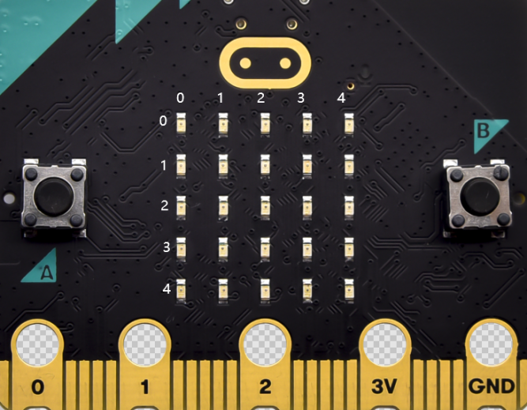
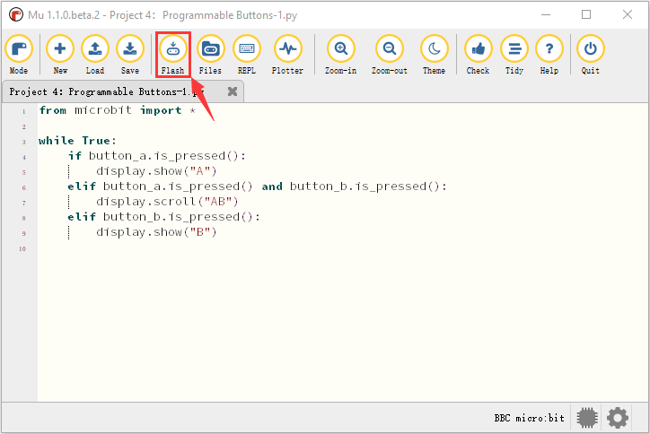
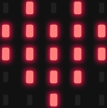
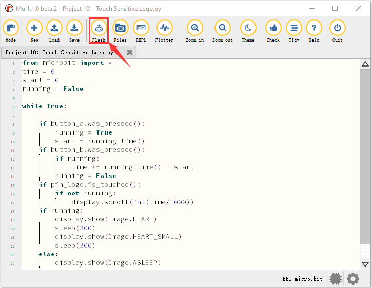
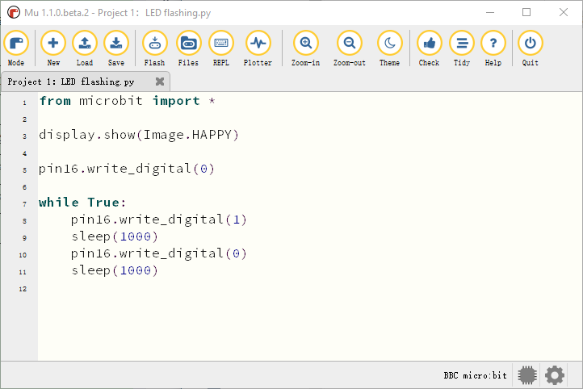
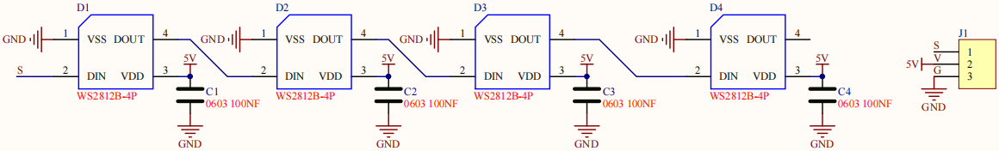
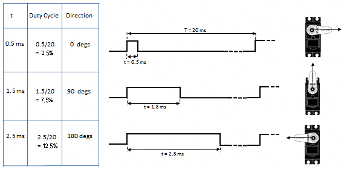
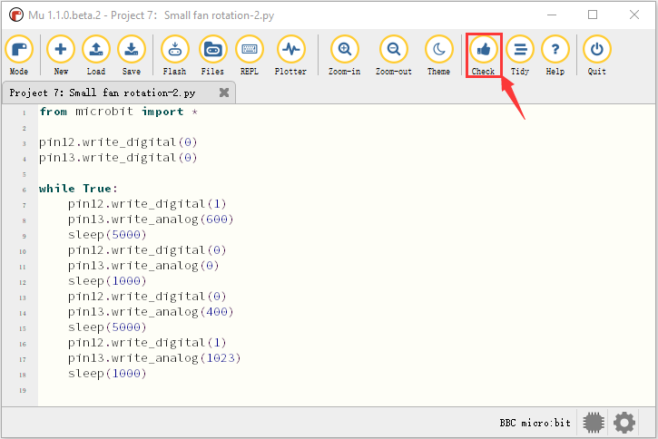
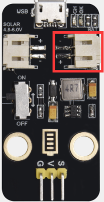

# KS4027 KS4028 Smart Home Kit for Micro:bit Python tutorial

## 1.Introduction：

Fueled by the rapid development of technology, smart homes automatically
controlled remotely by smart phones and other devices have become more common.
For the same reason, they have increasingly gained closer attention and caught
people ‘s fancy.

Bearing the aim to make improvements in household living conditions, the smart
home system has been integrated with technologies including computer science,
telecommunication, automatic control and others and emerged as a comprehensive
and smart system featuring safety, convenience, coziness, services , utility and
environmental consciousness.

## 2.Description：

Launched by Keyestudio, this smart home kit is based on the open-source hardware
of Micro:bit and designed for those who dream of living a more comfortable life
with the help of technologies.

This smart home system, with Micro:bit as its control board, is equipped with a
1602 LCD, a DHT11 temperature and humidity sensor, an analog gas sensor(MQ_2), a
PIR motion sensor , a 6812 RGB module, a servo, a steam sensor, a Micro:bit BT
and other sensors.

With the help of these sensors, this kit can be applied to detect temperature,
humidity and the concentration of flammable gases in your home and open and
close doors. Furthermore, all the information detected can display on 1602 LCD
in real time available for you to check and monitor via smart phones or iPad. By
the way, it supports powering by solar energy or via USB cable.

This tutorial programs in MicroPython language which is the Micro:bit version of
Python language. It will guide you to use software Mu to write MicroPython
language for Micro:bit main board to control the smart home system. In this
process, not only can you enhance your ability to make stuffs but also learn the
skills of programming.

Python is one of the most popular programming language especially in machine
learning for its availability and accessibility have brought huge convenience to
this field. However, MicroPython is a lean and efficient implementation of the
Python programming language for microcontrollers and embedded systems.

This tutorial is a Python tutorial for micro:bit smart home. If you haven't
learned the basic tutorial ( Makecode version of Tutorial), we strongly
recommend you to learn it first. Because the basic one is programmed using
graphical blocks, which is easier to understand and start.

## 3.Preparations:

**3.1Background Information about Micro:bit**

**( 1 )What is Micro:bit?**

Micro:bit is an open source hardware platform based on the ARM architecture
launched by British Broadcasting Corporation (BBC) together with ARM, Barclays,
element14, Microsoft and other institutions. The core device is a 32-bit Arm
Cortex-M4 with FPU micro-processing.

Though it is just the size of a credit card, the Micro:bit main board is
equipped with loads of components,including a 5\*5 LED dot matrix, 2
programmable buttons, an accelerometer, a compass, a thermometer, a
touch-sensitive logo and a MEMS microphone, a Bluetooth module of low energy,
and a buzzer and others. Thus, it also boasts multiple functions.

The buzzer built in the other side of the board makes playing all kinds of sound
possible without any external equipment. The golden fingers and gears added
provide a better fixing of crocodile clips. Moreover, this board has a sleeping
mode to lower power consumption of batteries and it can be entered if users long
press the Reset & Power button on the back of it. It is capable of reading the
data of sensors, controlling servos and RGB lights and attaching with a shield
so as to connect with various sensors. It also supports a variety of codes and
graphical programming platforms, and is compatible with almost all PCs and
mobile devices. It has no need to install drivers. It is of high integration of
electronic modules, and has a serial port monitoring function for easy
debugging.

The board has found wild applications. It can be applied in programming video
games, making interactions between light and sound, controlling a robot,
conducting scientific experiments, developing wearable devices and make some
cool inventions like robots and musical instruments, basically everything
imaginable.

**( 2 )Layout**

For the Micro: Bit main board, pressing the Reset & Power button , it will reset
the Micro: Bit and rerun the program.

For more information,please resort to following links：

<https://tech.microbit.org/hardware/>

https://microbit.org/new-microbit/

https://www.microbit.org/get-started/user-guide/overview/

<https://microbit.org/get-started/user-guide/features-in-depth/>

**( 3 ) Pinout**

**The functions of pins:**

| GPIO                       | P0，P1，P2，P3，P4，P5，P6，P7，P8，P9，P10，P11，P12，P13，P14，P15，P16，P19，P20                |
|----------------------------|----------------------------------------------------------------------------------------------------|
| ADC/DAC                    | P0，P1，P2，P3，P4，P10                                                                            |
| IIC                        | P19（SCL），P20（SDA）                                                                             |
| SPI                        | P13（SCK），P14（MISO），P15（MOSI）                                                               |
| PWM（used frequently）     | P0，P1，P2，P3，P4，P10                                                                            |
| PWM（not frequently used） | P5、P6、P7、P8、P9、P11、P12、P13、P14、P15、P16、P19、P20                                         |
| Occupied                   | P3(LED Col3)，P4(LED Col1)，P5(Button A)，P6(LED Col4)，P7(LED Col2)，P10(LED Col5)，P11(Button B) |

Browse the official website for more details:

<https://tech.microbit.org/hardware/edgeconnector/>

<https://microbit.org/guide/hardware/pins/>

**( 4 )Notes for the application of Micro:bit main board**

1.  It is recommended to cover it with a silicone protector to prevent short
    circuit for it has a lot of sophisticated electronic components.

1.  Its IO port is very weak in driving since it can merely handle current less
    than 300mA. Therefore, do not connect it with devices operating in large
    current, such as servo MG995 and DC motor or it will get burnt. Furthermore,
    you must figure out the current requirements of the devices before you use
    them and it is generally recommended to use the board together with a
    Micro:bit shield.

1.  It is recommended to power the main board via the USB interface or via the
    battery of 3V. The IO port of this board is 3V, so it does not support
    sensors of 5V. If you need to connect sensors of 5 V, a Micro: Bit expansion
    board is required.

1.  When using pins(P3、P4、P6、P7、P10)shared with the LED dot matrix, blocking
    them from the matrix or the LEDs may display randomly and the data about
    sensors connected maybe wrong.

1.  Pin 19 and 20 can not be used as IO ports though the Makecode shows they
    can. They can only be used as I2C communication.

1.  The battery port of 3V cannot be connected with battery more than 3.3V or
    the main board will be damaged.

1.  Forbid to operate it on metal products to avoid short circuit.

To put it simple, Micro:bit V2 main board is like a microcomputer which has made
programming at our fingertips and enhanced digital innovation. And as for
programming environment, BBC provides a website:

<https://microbit.org/code/,> which has a graphical MakeCode program easy for
use.

### 3.2.Install Micro:bit driver

Micro:bit is free of driver installation. However, in case your computer fail to
recognize the main board, you can install the diver too.

Just enter the link https://fs.keyestudio.com/KS4027-4028

to download the driver file  of
micro:bit in file folder .

## 4.Python

The following instructions are applied for Windows system but can also serve as
a reference if you are using a different system.

This tutorial is written for Python language. If you want to use graphical code
programming, please refer to the manual "Makecode Tutorial.pdf". In the root
directory of the resource you downloaded, there is a folder named "Python
tutorial", which stores all the Python code of Microbit smart home. The Python
code file is a file ending with ".py".

### 4.1.Python

Python is a scripting language. It has embraced a huge ecology after years of
development evidenced by the fact that many of hot artificial intelligence are
written in it. It is worth learning.

Micro:bit can be programmed in Python language. While since the micro:bit main
board is a microcontroller, the hardware difference makes the micro:bit unable
to fully support Python. Thus here comes the MicroPython, which is specially
designed for micro:bit and can be regarded as the micro:bit version of Python.

MicroPython is a lean and efficient implementation of the [Python
3](http://www.python.org/) programming language that includes a small subset of
the Python standard library and is optimised to run on microcontrollers and in
constrained environments. It is very suitable for those who want to continue to
learn programming in depth, with a series of code snippets, various images and
music to help you program.

More details about it please log in official micro:bit website:

<https://microbit-micropython.readthedocs.io/en/latest/tutorials/introduction.html>

Python has two types of editors（web version and offline version).

Web version: <https://python.microbit.org/v/1.1>

The other one is the offline compiler tool
\-----Mu

(Download Mu：https://codewith.mu/en/download)

### 4.2.Mu

The official website for Mu is:

<https://codewith.mu/>.

Mu is a Python code editor for beginner programmers based on extensive feedback
given by teachers and learners.Mu doesn’t support 32-bit Windows. The latest
version is Mu 1.1.0-beta 2.

**Follow steps below to install Mu:**

Download Mu

Click“This PC”and right- click to select Properties to check the version of your
computer.

Below is shown system type of your computer.

Enter link: <https://codewith.mu/en/download> to download the corresponding
version of Mu.

Run and Install Mu

Find out the folder where Mu is downloaded and double-click file to install Mu.

Installation for Mac OSX please refer
to：https://codewith.mu/en/howto/1.1/install_macos .

The installation method is similar and we will demonstrate how to download Mu on
Windows 10.

Windows 10

You will view the page pop up, then click More info;

Then click“Run anyway”;

Check the license agreement and tick to agree and tap”Install”;

Just wait for a few seconds until the installation is finished;

Finally,click“Finish”. 

Start Mu:

Click Mu icon to get started. It may take a while for the first time;

Mu’s main interface is shown below:

1.  **Projects：**

**Project 1: Heartbeat**

**(1)Project Introduction**

This project is easy to conduct with a micro:bit main board, a Micro USB cable
and a computer.This experiment serves as a starter for your entry to the magical
programming world of Micro:bit.

**(2)Preparations:**

A. Attach the Micro:bit main board to your computer via the USB cable;

B.Open the offline version of Mu.

**(3)Test Code：**

Open Mu software, click Mode, then click“BBC micro：bit”and“OK”

Tap“Load”, select“Project 1：Heartbeat.py”file and click“open”:

| File Type   | Route                                                                       | File Name               |
|-------------|-----------------------------------------------------------------------------|-------------------------|
| Python file | KS4027 folder/Python Tutorial/Python Code/Project Code/Project 1：Heartbeat | Project 1：Heartbeat.py |

There is another way to import code. Open Mu software and drag
file”Project1:Heartbeat.py”into it.

You can also input code in the edit window yourself.

(note:all English words and symbols must be written in English.)

The following is a list of built-in images.

• Image.HEART

• Image.HEART_SMALL

• Image.HAPPY

• Image.SMILE

• Image.SAD

• Image.CONFUSED

• Image.ANGRY

• Image.ASLEEP

• Image.SURPRISED

• Image.SILLY

• Image.FABULOUS

• Image.MEH

• Image.YES

• Image.NO

• Image.CLOCK12, Image.CLOCK11, Image.CLOCK10, Image.CLOCK9, Image.CLOCK8,
Image.CLOCK7, Image.CLOCK6, Image.CLOCK5,

Image.CLOCK4, Image.CLOCK3, Image.CLOCK2,Image.CLOCK1

• Image.ARROW_N, Image.ARROW_NE, Image.ARROW_E, Image.ARROW_SE, Image.ARROW_S,
Image.ARROW_SW, Image.ARROW_W, Image.ARROW_NW

• Image.TRIANGLE

• Image.TRIANGLE_LEFT

• Image.CHESSBOARD

• Image.DIAMOND

• Image.DIAMOND_SMALL

• Image.SQUARE

• Image.SQUARE_SMALL

• Image.RABBIT

• Image.COW

• Image.MUSIC_CROTCHET

• Image.MUSIC_QUAVER

• Image.MUSIC_QUAVERS

• Image.PITCHFORK

• Image.PACMAN

• Image.TARGET

• Image.TSHIRT

• Image.ROLLERSKATE

• Image.DUCK

• Image.HOUSE

• Image.TORTOISE

• Image.BUTTERFLY

• Image.STICKFIGURE

• Image.GHOST

• Image.SWORD

• Image.GIRAFFE

• Image.SKULL

• Image.UMBRELLA

• Image.SNAKE，Image.ALL_CLOCKS，Image.ALL_ARROWS

Connect micro:bit board to computer with USB cable, click“Flash”to download code
to micro:bit board.

The code, even it is wrong, can be downloaded to micro:bit board successfully,
yet not working on micro:bit board.

Click“Flash”to download code to micro:bit.

Click“REPL”and press the reset button on micro:bit, the error information will
be displayed on REPL window, as shown below:

Click“REPL”again to turn off REPL mode, then you could refresh new code.

To make sure code correct, you only need to tap“Check”. The errors will be shown
on the window.

Modify the code according to the prompt and click“Check”.

More tutorials, log in website please:<https://codewith.mu/en/tutorials/>.

**(4)Test Results:**

After uploading test code to micro:bit main board, clicking“Flash”again and
keeping the connection with the computer to power the main board, the LED dot
matrix shows pattern “”and then
“”alternatively.

**(5)Code Explanation：**

| **from**  microbit **import** \* | Import the library file of micro：bit                                 |
|----------------------------------|-----------------------------------------------------------------------|
| **while True:**                  | This is a permanent loop that makes micro:bit execute the code of it. |
| display.show(Image.HEART)        | micro：bit shows “❤”                                                  |
| sleep(500)                       | Delay in 500ms                                                        |
| display.show(Image.HEART_SMALL)  | micro：bit displays“”  |

### Project 2: Light A Single LED

1.  **Project Introduction**

The LED dot matrix consists of 25 LEDs arranged in a 5 by 5 square. In order to
locate these LEDs quickly, as the figure shown below, we can regarded this
matrix as a coordinate system and create two aces by marking those in rows from
0 to 4 from top to bottom, and the ones in columns from 0 to 4 from the left to
the right. Therefore, the LED sat in the second of the first line is (1,0）and
the LED positioned in the fifth of the fourth column is (3,4）and others
likewise.

**(2)Preparations:**

A. Attach the Micro:bit main board to your computer via the USB cable;

B.Open the offline version of Mu.

**(3)Test Code：**

Enter Mu software and open the file“Project 2： Light A Single LED.py”to import
code:

| Type        | Route                                                                                 | File Name                         |
|-------------|---------------------------------------------------------------------------------------|-----------------------------------|
| Python file | KS4027 folder/Python Tutorial/Python Code/Project Code/Project 2： Light A Single LED | Project 2： Light A Single LED.py |

You can also input code in the editing window yourself.

(Note:all English words and symbols must be written in English)

Click“Check”to examine error in the code. The program proves wrong if underlines
and cursors are shown.

If the code is correct, connect micro:bit to computer and click“Flash”to
download code to micro:bit board.

**(4)Test Results:**

After uploading test code to micro:bit main board and powering the main board
via the USB cable, the LED in (1,0) lights up for 0.5s and the one in (3,4)
shines for 0.5s and repeat this sequence.

**(5)Code Explanation:**

| from microbit import \*                                                                                                                                                     | Import the library file of micro：bit                                                                                                                                                                                                                                                  |
|-----------------------------------------------------------------------------------------------------------------------------------------------------------------------------|----------------------------------------------------------------------------------------------------------------------------------------------------------------------------------------------------------------------------------------------------------------------------------------|
| val1 = Image("09000:""00000:""00000:""00000:""00000:")      val2 = Image("00000:""00000:""00000:""00000:""00090:")  val3 = Image("00000:""00000:""00000:""00000:""00000:")  | Set Image() to val1 Set pixel of LED on micro:bit to the value in 0\~9  Pixel of each LED on micro:bit can be set in one of ten values If set pixel to 0 (zero) ，which means in close state, literally, 0 is brightness, 9 is best brightness Set Image() to val2 Set Image() to val3 |
| while True:                                                                                                                                                                 | This is a permanent loop that makes micro:bit execute the code of it.                                                                                                                                                                                                                  |
| display.show(val1)  sleep(500)  display.show(val3)  sleep(500)                                                                                                              |  LED at (1,0) blinks for 0.5s                                                                                                                                                                                                                                                          |
| display.show(val2)  sleep(500)  display.show(val3)  sleep(500)                                                                                                              |  LED at (3,4) flashes for 0.5s                                                                                                                                                                                                                                                         |

**(6)Reference**

sleep(ms) : delay time

For more details about delay, please refer to:

https://microbit-micropython.readthedocs.io/en/latest/utime.html

**Project 3: LED Dot Matrix**

1.  **Project Introduction**

Dot matrices are very commonplace in daily life. They have found wide
applications in LED advertisement screens, elevator floor display, bus stop
announcement and so on.

The LED dot matrix of Micro: Bit main board contains 25 LEDs in a grid.
Previously, we have succeeded in controlling a certain LED to light by
integrating its position value into the test code. Supported by the same theory,
we can turn on many LEDs at the same time to showcase patterns, digits and
characters.

What’s more, we can also click”show icon“ to choose the pattern we like to
display. Last but not the least, we can design patterns by ourselves as well.

**(2)Preparations:**

A. Attach the Micro:bit main board to your computer via the USB cable;

B. Open the offline version of Mu.

**(3)Test Code：**

You could open“Project 3：LED Dot Matrix.py“file to Import code（[How to load
the project code?](##AS)）

| File Type   | Route                                                                            | File Name                    |
|-------------|----------------------------------------------------------------------------------|------------------------------|
| Python file | KS4027 folder/Python Tutorial/Python Code/Project Code/Project 3：LED Dot Matrix | Project 3：LED Dot Matrix.py |

You can also input code in the editing window yourself.

(note:all words and symbols must be written in English.)

Click“Check”to examine error in the code. The program proves wrong if underlines
and cursors are shown.

If the code is correct, connect micro:bit to computer and click“Flash”to
download code to micro:bit board.

**(4)Test Results:**

After uploading test code to micro:bit main board and powering the main board
via the USB cable, we find that the 5\*5 dot matrix start to show numbers
1,2,3,4 and 5, and then it alternatively shows a downward arrow
, word “Hello”, a heart pattern
, an arrow pointing at northeast
, then at southeast
, then at southwest
, and then at northwest
.

**(5)Code Explanation:**

| **from** microbit **import** \*                                                                                      | Import the library file of micro：bit                                                                                                 |
|----------------------------------------------------------------------------------------------------------------------|---------------------------------------------------------------------------------------------------------------------------------------|
| val = Image("09000:""00000:""00000:""00000:""00000:")                                                                |  Set Image() to variable val                                                                                                          |
| display.show(val)                                                                                                    | micro:bit shows“→”                                                                                                                    |
| display.show('1')                                                                                                    | micro:bit shows“1”                                                                                                                    |
| sleep(500)                                                                                                           | Delay in 500ms                                                                                                                        |
| display.scroll("hello!")                                                                                             | micro:bit scrolls to show“hello!”                                                                                                     |
| display.show(Image.HEART)                                                                                            | micro:bit displays“❤”pattern                                                                                                          |
| display.show(Image.ARROW_NE) display.show(Image.ARROW_SE) display.show(Image.ARROW_SW)  display.show(Image.ARROW_NW) | micro:bit shows“Northeast”arrow micro:bit displays“Southeast”arrow micro:bit shows“Southwest”arrow micro:bit displays“Northwest”arrow |
| display.clear()                                                                                                      | The LED dot matrix of micro:bit clears                                                                                                |

**(6) Reference:**

display.scroll() ：

The display scrolls to show the values, if it is integer or float, we use
str（）to transfer into character strings.

More details, please refer to

<https://microbit-micropython.readthedocs.io/en/latest/utime.html>

**Project 4: Programmable Buttons**

1.  **Project Introduction**

Buttons can be used to control
circuits. In an integrated circuit with a push button, the circuit is connected
when pressing the button and it is open the other way around.

Both ends of button are like two mountains. There is a river in between.

The internal metal piece connect the two sides to let the current pass, just
like building a bridge to connect two mountains.

Micro: Bit main board boasts three push buttons, two are programmable
buttons(marked with A and B), and the one on the other side is a reset button.
By pressing the two programmable buttons can input three different signals. We
can press button A or B alone or press them together and the LED dot matrix
shows A,B and AB respectively. Let’s get started.

**(2)Preparations:**

A. Attach the Micro:bit main board to your computer via the USB cable;

1.  Open the offline version of Mu.

**(3)Test Code1：**

Enter Mu software and open the file“Project 4：Code-1.py”to import code:

（[How to load the project code?](##AS)）

| File Type   | Route                                                                                  | File Name             |
|-------------|----------------------------------------------------------------------------------------|-----------------------|
| Python file | KS4027 folder/Python Tutorial/Python Code/Project Code/Project 4：Programmable Buttons | Project 4：Code-1.py  |

You can also input code in the editing window yourself.

(note:all words and symbols must be written in English)

Click“Check”to examine error in the code. The program proves wrong if underlines
and cursors are shown.

If the code is correct, connect micro:bit to computer and click“Flash”to
download code to micro:bit board.

**(4)Test Results1:**

After uploading test code to micro:bit main board and powering the main board
via the USB cable, the 5\*5 LED dot matrix shows “A”if button A is pressed and
then released, “B” if button B pressed and released, and “AB” if button A and B
pressed together and then released.

**(5)Test Code2：**

Enter Mu software and open the file“Project 4：Code-2.py

”to import code:（[How to load the project code?](##AS)）

| File Type   | Route                                                                                  | File Name             |
|-------------|----------------------------------------------------------------------------------------|-----------------------|
| Python file | KS4027 folder/Python Tutorial/Python Code/Project Code/Project 4：Programmable Buttons | Project 4：Code-2.py  |

You can also input code in the editing window yourself.

(note:all English words and symbols must be written in English)

Click“Check”to examine error in the code. The program proves wrong if underlines
and cursors are shown.

Please notice that the following sentences are just for warning so the presence
of them doesn’t mean the code is wrong.

If the code is correct, connect micro:bit to computer and click“Flash”to
download code to micro:bit board.

**(6)Test Results2：**

After uploading test code to micro:bit main board and powering the main board
via the USB cable, when the button A is pressed, the LEDs turning red increase
while when the button B pressed, the LEDs turning red reduce.

**(7)Code Explanation：**

| from microbit import \*                                                                                                                                                                                                                                                                                                                                                                                                       | Import the library file of micro：bit                                                                                                                                                                                                                                                                                                                                                                                                                                                                                                                                                        |
|-------------------------------------------------------------------------------------------------------------------------------------------------------------------------------------------------------------------------------------------------------------------------------------------------------------------------------------------------------------------------------------------------------------------------------|----------------------------------------------------------------------------------------------------------------------------------------------------------------------------------------------------------------------------------------------------------------------------------------------------------------------------------------------------------------------------------------------------------------------------------------------------------------------------------------------------------------------------------------------------------------------------------------------|
| while True:                                                                                                                                                                                                                                                                                                                                                                                                                   | This is a permanent loop that makes micro:bit execute the code of it.                                                                                                                                                                                                                                                                                                                                                                                                                                                                                                                        |
| if button_a.is_pressed():  display.show("A")  elif button_a.is_pressed() and button_b.is_pressed(): display.scroll("AB")  elif button_b.is_pressed():  display.show("B")                                                                                                                                                                                                                                                      | If button A is pressed micro:bit shows“A” If button A and B are pressed at same time micro:bit displays“AB” If button B is pressed micro:bit shows“B”                                                                                                                                                                                                                                                                                                                                                                                                                                        |
| while button_a.is_pressed() == True: sleep(10) if button_a.is_pressed() == False: a = a + 1 if(a \>= 5): a = 5 break while button_b.is_pressed() == True: sleep(10) if button_b.is_pressed() == False: a = a - 1 if(a \<= 0): a = 0 break if a == 0: display.show(val1) if a == 1: display.show(val2) if a == 2: display.show(val3) if a == 3: display.show(val4) if a == 4: display.show(val5) if a == 5: display.show(val6) | When the button A is pressed Delay in 10ms to eliminate the shaking of button A when button A is released, Variable a adds 1 If variable a≥5 Variable a=5 exit the loop  when button B is pressed Delay in 10ms to eliminate the shaking of button B When the button B is released Variable a reduces 1 gradually When a≤0 Variable a=0 exit the loop When a=0 micro:bit shows pattern val1 When a=1 micro:bit displays pattern val2 When a=2 micro:bit shows pattern val3 If a=3 micro:bit displays pattern val4 If a=4 micro:bit shows pattern val5 If a=5 micro:bit displays pattern val6 |

**Project 5: Temperature Detection**

1.  **Project Introduction**

The Micro:bit main board is not equipped with a temperature sensor, but uses the
temperature sensor built into NFR52833 chip for temperature detection.
Therefore, the detected temperature is more closer to the temperature of the
chip, and there maybe deviation from the ambient temperature. The sensor can
detect temperature of external environment with the range of 40℃\~105℃.

In this project, we use the sensor to test the temperature in the current
environment, and display the test results in the display data (device). And then
control the LED dot matrix to display different patterns by setting the
temperature range detected by the sensor.

Note: the temperature sensor of Micro:bit main board is shown below:

**(2)Preparations:**

A. Attach the Micro:bit main board to your computer via the USB cable;

B. Open the offline version of Mu.

**(3)Test Code1:**

Enter Mu software and open the file“Project 5：Code-1.py”to import code:

| File Type   | Route                                                                                   | File Name            |
|-------------|-----------------------------------------------------------------------------------------|----------------------|
| Python file | KS4027 folder/Python Tutorial/Python Code/Project Code/Project 5：Temperature Detection | Project 5：Code-1.py |

You can also input code in the editing window yourself.(note:all English words
and symbols must be written in English)

Click“Check”to examine error in the code. The program proves wrong if underlines
and cursors are shown.

If the code is correct, connect micro:bit to computer and click“Flash”to
download code to micro:bit board.

**(4)Test Results1:**

After downloading test code 1 to micro:bit board, keep USB connected and
click“REPL”and press the reset button on micro:bit. Then REPL window will show
the ambient temperature value, as shown below:( C stands for temperature unit)

**(5)Test Code2:**

Enter Mu software and open the file“Project 5：Code-2.py”to import code:

| File Type   | Route                                                                                   | File Name            |
|-------------|-----------------------------------------------------------------------------------------|----------------------|
| Python file | KS4027 folder/Python Tutorial/Python Code/Project Code/Project 5：Temperature Detection | Project 5：Code-2.py |

You can also input code in the editing window yourself.(note:all English words
and symbols must be written in English)

The temperature value can be set in compliance with the real temperature.

Click“Check”to examine error in the code. The program proves wrong if underlines
and cursors are shown.

If the code is correct, connect micro:bit to computer and click“Flash”to
download code to micro:bit board.

**(6)Test Results2:**

After uploading the code 2 to the board, when the ambient temperature is less
than 35℃, the 5\*5 LED dot matrix shows
. When the temperature is
equivalent to or greater than 35℃, the
pattern appears.

**(7)Code Explanation:**

| **from** microbit **import** \*                                                                     | Import the library file of micro：bit                                                                                                        |
|-----------------------------------------------------------------------------------------------------|----------------------------------------------------------------------------------------------------------------------------------------------|
| **while True:**                                                                                     | This is a permanent loop that makes micro:bit execute the code of it.                                                                        |
| Temperature = temperature()                                                                         | Set temperature() to Temperature                                                                                                             |
| print("Temperature:", Temperature, "C")                                                             | BBC micro:bit REPL prints temperature value                                                                                                  |
| sleep(500)                                                                                          | Delay in 500ms                                                                                                                               |
| **if** temperature() \>= 35: display.show(Image.HEART)  **else**:  display.show(Image.HEART_SMALL)  | If temperature value ≥35℃  micro:bit shows“♥” If temperature value\<35℃  micro:bit displays“” |

**Project 6: Geomagnetic Sensor**

1.  **Project Introduction**

This project aims to explain the use of the Micro: bit geomagnetic sensor, which
can not only detect the strength of the geomagnetic field, but also be used as a
compass to find bearings. It is also an important part of the Attitude and
Heading Reference System (AHRS).

Micro: Bit main board uses LSM303AGR geomagnetic sensor, which supports four
modes namely 100 kHz,400 kHz,1 MHz and 3.4 MHz and the dynamic range of magnetic
field is ±50 gauss.

In the board, the magnetometer module is used in both magnetic detection and
compass. In this experiment, the compass will be introduced first, and then the
original data of the magnetometer will be checked.The main component of a common
compass is a magnetic needle, which can be rotated by the geomagnetic field and
point toward the geomagnetic North Pole (which is near the geographic South
Pole) to determine direction.

Attention: this geomagnetic sensor built in the board can help us determine
bearings by showing readings in the value from 0 to 360. And the system will ask
us to calibrate it the first time it is put into operation by rotating the
board.Please note that metal materials around may attenuate the accuracy of the
reading and calibration.

**(2)Preparations:**

A. Attach the Micro:bit main board to your computer via the USB cable;

B.Open the offline version of Mu.

1.  **Test code1:：**

Enter Mu software and open the file“Project 6：Code-1.py”to import code:

| File Type   | Route                                                                               | File Name            |
|-------------|-------------------------------------------------------------------------------------|----------------------|
| Python file | KS4027 folder/Python Tutorial/Python Code/Project Code/Project 6 Geomagnetic Sensor | Project 6：Code-1.py |

You can also input code in the editing window yourself.

(note:all English words and symbols must be written in English)

Click“Check”to examine error in the code. The program proves wrong if underlines
and cursors are shown.

If the code is correct, connect micro:bit to computer and click“Flash”to
download code to micro:bit board.

Note: We need to calibrate micro：bit due to different magnetic field in
different areas. Micro:bit will prompt you to calibrate when you use it first
time.

**(4)Test Result1：**

After uploading test code1 to micro:bit main board and powering the board via
the USB cable, and pressing the button A, the board asks us to calibrate compass
and the LED dot matrix shows “TILT TO FILL SCREEN”. Then enter the calibration
page. Rotate the board until all 25 red LEDs are on as shown below.

After that, a smile pattern
 appears, which implies
the calibration is done. When the calibration process is completed, pressing the
button A will make the magnetometer reading display directly on the screen. And
the direction north, east, south and west correspond to 0°, 90°, 180° and 270°
respectively.

**(5)Test code2:**

For the below picture, the arrow pointing to the upper right when the value
ranges from 292.5 to 337.5. Because 0.5 can’t be input in the code, the values
we get are 293 and 338.

Then add other statements to make a set of complete code.

Enter Mu software and open the file“Project 6：Code-2.py”to import code:

| File Type   | Route                                                                               | File Name            |
|-------------|-------------------------------------------------------------------------------------|----------------------|
| Python file | KS4027 folder/Python Tutorial/Python Code/Project Code/Project 6 Geomagnetic Sensor | Project 6：Code-2.py |

You can also input code in the editing window yourself.(note:all English words
and symbols must be written in English)

Click“Check”to examine error in the code. The program proves wrong if underlines
and cursors are shown.

If the code is correct, connect micro:bit to computer and click“Flash”to
download code to micro:bit board.

**(6)Test Results2:**

Upload code 2 and plug micro:bit into power. After calibration, tilt micro:bit
board, and the LED dot matrix displays the direction signs.

**(6)Code Explanation：**

| **from** microbit **import** \*                                                                                                                                                                                                                                                                                                                                                                                                                                                                         | Import the library file of micro：bit                                                                                                                                                                                                                                                                               |
|---------------------------------------------------------------------------------------------------------------------------------------------------------------------------------------------------------------------------------------------------------------------------------------------------------------------------------------------------------------------------------------------------------------------------------------------------------------------------------------------------------|---------------------------------------------------------------------------------------------------------------------------------------------------------------------------------------------------------------------------------------------------------------------------------------------------------------------|
| compass.calibrate()                                                                                                                                                                                                                                                                                                                                                                                                                                                                                     | Compass calibration                                                                                                                                                                                                                                                                                                 |
| **while True:**                                                                                                                                                                                                                                                                                                                                                                                                                                                                                         | This is a permanent loop that makes micro:bit execute the code of it.                                                                                                                                                                                                                                               |
| **if** button_a.is_pressed():  display.scroll(compass.heading())                                                                                                                                                                                                                                                                                                                                                                                                                                        | When the button A is pressed Micro:bit scrolls to show the value of compass                                                                                                                                                                                                                                         |
| x = 0                                                                                                                                                                                                                                                                                                                                                                                                                                                                                                   | Set variable x=0                                                                                                                                                                                                                                                                                                    |
| x = compass.heading()                                                                                                                                                                                                                                                                                                                                                                                                                                                                                   | Set the value of compass to variable x                                                                                                                                                                                                                                                                              |
| **if**...**elif**...**else**                                                                                                                                                                                                                                                                                                                                                                                                                                                                            | Condition judgement statement:if...else if...else                                                                                                                                                                                                                                                                   |
| display.show(Image("00999:""00099:""00909:""09000:""90000")) display.show(Image("99900:""99000:""90900:""00090:""00009")) display.show(Image("00900:""09000:""99999:""09000:""00900")) display.show(Image("00009:""00090:""90900:""99000:""99900")) display.show(Image("00900:""00900:""90909:""09990:""00900")) display.show(Image("90000:""09000:""00909:""00099:""00999")) display.show(Image("00900:""00090:""99999:""00090:""00900")) display.show(Image("00900:""09990:""90909:""00900:""00900")) | Micro:bit shows the Northeast arrow sign Micro:bit shows the Northwest arrow sign Micro:bit shows the west arrow sign Micro:bit shows the Southwest arrow sign Micro:bit shows the South arrow sign Micro:bit shows the South arrow sign  Micro:bit shows the East arrow sign Micro:bit shows the North arrow sign  |

**Project 7: Accelerometer**

1.  **Project Introduction**

The Micro: Bit main board V2 has a built-in LSM303AGR gravity acceleration
sensor, also known as accelerometer, with a resolution of 8/10/12 bits. The code
section sets the range to 1g, 2g, 4g, and 8g.

We often use accelerometer to detect the status of machines.

In this project, we will introduce how to measure the position of the board with
the accelerometer. And then have a look at the original three-axis data output
by the accelerometer.

**(2)Preparations:**

A. Attach the Micro:bit main board to your computer via the USB cable;

B. Open the offline version of Mu.

**(3)Test Code1:**

Enter Mu software and open the file“Project 7：Accelerometer-1.py”to import
code:

（[How to load the project code?](##AS)）

| File Type   | Route                                                                           | File Name                     |
|-------------|---------------------------------------------------------------------------------|-------------------------------|
| Python file | KS4027 folder/Python Tutorial/Python Code/Project Code/Project 7：Accelerometer | Project 7：Accelerometer-1.py |

You can also input code in the editing window yourself.(note:all English words
and symbols must be written in English)

Click“Check”to examine error in the code. The program proves wrong if underlines
and cursors are shown.

If the code is correct, connect micro:bit to computer and click“Flash”to
download code to micro:bit board.

**(4)Test Results1：**

After uploading the test code 1 to micro:bit main board and powering the board
via the USB cable, if we shake the Micro: Bit main board，no matter at any
direction, the LED dot matrix displays the digit “1”.

When it is kept upright（make its logo above the LED dot matrix）, the number 2
shows.

When it is kept upside down( make its logo below the LED dot matrix) , it shows
as below.

When it is placed still on the desk, showing its front side, the number 4
appears.

When it is placed still on the desk, showing its back side, the number 5
exhibits.

When the board is tilted to the left , the LED dot matrix shows the number 6 as
shown below.

When the board is tilted to the right , the LED dot matrix displays the number 7
as shown below：

When the board is knocked to the floor, this process can be considered as a free
fall and the LED dot matrix shows the number 8. (Please note that this test is
not recommended for it may damage the main board.)

Attention: if you’d like to try this function, you can also set the acceleration
to 3g, 6g or 8g. But still ,we do not recommend.

**(5)Test code2:**

Enter Mu software and open the file“Project 7：Accelerometer-2.py”to import
code:

| File Type   | Route                                                                           | File Name                     |
|-------------|---------------------------------------------------------------------------------|-------------------------------|
| Python file | KS4027 folder/Python Tutorial/Python Code/Project Code/Project 7：Accelerometer | Project 7：Accelerometer-2.py |

You can also input code in the editing window yourself.(note:all English words
and symbols must be written in English)

Click“Check”to examine error in the code. The program proves wrong if underlines
and cursors are shown.

If the code is correct, connect micro:bit to computer and click“Flash”to
download code to micro:bit board.

After referring to the MMA8653FC data manual and the hardware schematic diagram
of the Micro: Bit main board, the accelerometer coordinate of the Micro: Bit are
shown in the figure below:

**(6)Test Results2:**

Upload the test code 1 to micro:bit main board and power the board via the USB
cable.

Click“REPL”and press the reset button. The value of acceleration on X axis, Y
axis and Z axis are shown below:

**(7)Code Explanation：**

| **from** microbit **import** \*                                                                                                                                                                                                                                                                                                                                                              | Import the library file of micro：bit                                                                                                                                                                                                                                                                                                                                                                                                                                                                                                      |
|----------------------------------------------------------------------------------------------------------------------------------------------------------------------------------------------------------------------------------------------------------------------------------------------------------------------------------------------------------------------------------------------|--------------------------------------------------------------------------------------------------------------------------------------------------------------------------------------------------------------------------------------------------------------------------------------------------------------------------------------------------------------------------------------------------------------------------------------------------------------------------------------------------------------------------------------------|
| gesture = accelerometer.current_gesture()                                                                                                                                                                                                                                                                                                                                                    | Set accelerometer.current_gesture() to gesture                                                                                                                                                                                                                                                                                                                                                                                                                                                                                             |
| **while True:**                                                                                                                                                                                                                                                                                                                                                                              | This is a permanent loop that makes micro:bit execute the code of it.                                                                                                                                                                                                                                                                                                                                                                                                                                                                      |
| **if** gesture == "shake":  display.show("1")  **if** gesture == "up":  display.show("2")  **if** gesture == "down":  display.show("3")  **if** gesture == "face up":  display.show("4")  **if** gesture == "face down":  display.show("5")  **if** gesture == "left":  display.show("6")  **if** gesture == "right":  display.show("7")  **if** gesture == "freefall":  display.show("8")   | Shaking micro:bit board, number 1 will appear When log points to the North, number 2 will show up. When log points to the South, number 3 will be shown When the LED dot matrix is upward, the number 4 is shown. the number 5 is displayed when the LED dot matrix is downward. When Micro:bit board is tilt to the left, number 6 is shown. When micro:bit is tilt to the right When Micro:bit board is inclined to the right, number 7 is displayed. When it is free fall(accidentally making it fall), number 8 appears on dot matrix. |
| x = accelerometer.get_x()  y = accelerometer.get_y()  z = accelerometer.get_z()                                                                                                                                                                                                                                                                                                              | Read the acceleration value on x axis，the return value is integer, and set x= the read value on x axis Read the acceleration value on y axis，the return value is integer, and set y= the read value on y axis Read the acceleration value on z axis，the return value is integer, and set z= the read value on z axis                                                                                                                                                                                                                    |
| print("x, y, z:", x, y, z)                                                                                                                                                                                                                                                                                                                                                                   | The value of acceleration will be shown                                                                                                                                                                                                                                                                                                                                                                                                                                                                                                    |
| sleep(100)                                                                                                                                                                                                                                                                                                                                                                                   | Delay in 100ms                                                                                                                                                                                                                                                                                                                                                                                                                                                                                                                             |

**Project 8: Light Detection**

1.  **Project Introduction**

In this project, we focus on the light detection function of the Micro: Bit main
board. It is achieved by the LED dot matrix since the main board is not equipped
with a photoresistor.

**(2)Preparations:**

A. Attach the Micro:bit main board to your computer via the USB cable;

B. Open the offline version of Mu.

**(3)Test Code:**

Enter Mu software and open the file“project 8：Light Detection.py”to import
code:

（[How to load the project code?](##AS)）

| File Type   | Route                                                                             | File Name                     |
|-------------|-----------------------------------------------------------------------------------|-------------------------------|
| Python file | KS4027 folder/Python Tutorial/Python Code/Project Code/Project 8：Light Detection | project 8：Light Detection.py |

You can also input code in the editing window yourself.

(note:all English words and symbols must be written in English)

Click“Check”to examine error in the code. The program proves wrong if underlines
and cursors are shown.

If the code is correct, connect micro:bit to computer and click“Flash”to
download code to micro:bit board.

**(4)Test Results:**

Upload the test code to micro:bit main board, power the board via the USB cable
and click “Show console Device”.

Download code onto micro:bit board, don’t plug off USB cable. Click “REPL”and
press the reset buttons, the light intensity value will be displayed, as shown
below.

When the LED dot matrix is covered by hand, the light intensity showed is
approximately 0; when the LED dot matrix is exposed to light,the light intensity
displayed gets stronger with the light.

The 20 in the code is an arbitrary value of light intensity. If the current
light level is less than or equal to 20, the icon moon will appear on the LED
dot matrix. If it's bigger than 20, the sun will appear.

**(5)Code Explanation:**

| **from** microbit **import** \*             | Import the library file of micro：bit                                 |
|---------------------------------------------|-----------------------------------------------------------------------|
| gesture = accelerometer.current_gesture()   | Set accelerometer.current_gesture() to gesture                        |
| **while True:**                             | This is a permanent loop that makes micro:bit execute the code of it. |
| Lightintensity = display.read_light_level() | Set display.read_light_level() to Lightintensity                      |
| print("Light intensity:", Lightintensity)   | BBC microbit REPL prints the detected light intensity value           |
| sleep(100)                                  | Delay in 100ms                                                        |

### 

**Project 9: Speaker**

1.  **Project Introduction**

Micro: Bit main board has an built-in speaker, which makes adding sound to the
programs easier. It can also be programmed to air all kinds of tones, like
playing the song *Ode to Joy.*

**(2)Preparations:**

A. Attach the Micro:bit main board to your computer via the USB cable;

B.Open the offline version of Mu.

**(3)Test Code1:**

Enter Mu software and open the file“Project 9：Speaker-1.py”to import code:

（[How to load the project code?](##AS)）

| File Type   | Route                                                                     | File Name               |
|-------------|---------------------------------------------------------------------------|-------------------------|
| Python file | KS4027 folder/Python Tutorial/Python Code/Project Code/Project 9：Speaker | Project 9：Speaker-1.py |

You can also input code in the editing window yourself.

(note:all English words and symbols must be written in English)

Click“Check”to examine error in the code. The underlines and cursors signal that
the program is wrong.

If the code is correct, connect micro:bit to computer and click“Flash”to
download code to micro:bit board.

**(4)Test Results1:**

After uploading the test code1 to micro:bit main board and powering the board
via the USB cable, the speaker utters sound and the LED dot matrix shows the
logo of music.

**(5)Test Code2：**

Enter Mu software and open the file“Project 9：Speaker-2.py”to import code:

（[How to load the project code?](##AS)）

| File Type   | Route                                                                     | File Name               |
|-------------|---------------------------------------------------------------------------|-------------------------|
| Python file | KS4027 folder/Python Tutorial/Python Code/Project Code/Project 9：Speaker | Project 9：Speaker-2.py |

You can also input code in the editing window yourself.

(note:all English words and symbols must be written in English)

Click“Check”to examine error in the code. The underlines and cursors signal that
the program is wrong.

If the code is correct, connect micro:bit to computer and click“Flash”to
download code to micro:bit board.

The musical score of *Ode to Joy* is attached below:

Find more information about musical notations via this link:

https://en.wikipedia.org/wiki/Numbered_musical_notation

**(6) Test Results2:**

After uploading the test code2 to micro:bit main board and powering the board
via the USB cable, the speaker on built-in the Micro:bit board plays the sound
*Ode to Joy* and the LED dot matrix shows the logo of music.

**(7)Code Explanation：**

| **from** microbit **import** \*                                                                                                                                                                                                                                                                                                                                                                                                                                                                                                                                                                                                                                                                                                                                                                                                                                                                                                                                                                                                                                                                                                                               | Import the library of micro：bit                                      |
|---------------------------------------------------------------------------------------------------------------------------------------------------------------------------------------------------------------------------------------------------------------------------------------------------------------------------------------------------------------------------------------------------------------------------------------------------------------------------------------------------------------------------------------------------------------------------------------------------------------------------------------------------------------------------------------------------------------------------------------------------------------------------------------------------------------------------------------------------------------------------------------------------------------------------------------------------------------------------------------------------------------------------------------------------------------------------------------------------------------------------------------------------------------|-----------------------------------------------------------------------|
| **import** audio                                                                                                                                                                                                                                                                                                                                                                                                                                                                                                                                                                                                                                                                                                                                                                                                                                                                                                                                                                                                                                                                                                                                              | Audio library                                                         |
| **while True:**                                                                                                                                                                                                                                                                                                                                                                                                                                                                                                                                                                                                                                                                                                                                                                                                                                                                                                                                                                                                                                                                                                                                               | This is a permanent loop that makes micro:bit execute the code of it. |
| audio.play(Sound.GIGGLE)                                                                                                                                                                                                                                                                                                                                                                                                                                                                                                                                                                                                                                                                                                                                                                                                                                                                                                                                                                                                                                                                                                                                      | Emit the“giggle”sound                                                 |
| display.show（Image.MUSIC_QUAVER）                                                                                                                                                                                                                                                                                                                                                                                                                                                                                                                                                                                                                                                                                                                                                                                                                                                                                                                                                                                                                                                                                                                            | Music logo shows on the LED dot matrix on the micro:bit               |
| **import** music                                                                                                                                                                                                                                                                                                                                                                                                                                                                                                                                                                                                                                                                                                                                                                                                                                                                                                                                                                                                                                                                                                                                              | Import music library controlling sounds                               |
| tune = [ "E5:4"， "E5:4"， "F5:4"， "G5:4"， "G5:4"， "F5:4"， "E5:4", "D5:4"， "C5:4"， "C5:4"， "D5:4"， "E5:4"， "E5:4"， "D5:4", "D5:4"， "E5:4"， "E5:4"， "F5:4"， "G5:4"， "G5:4"， "F5:4", "E5:4"， "D5:4"， "C5:4"， "C5:4"， "D5:4"， "E5:4"， "D5:4", "C5:2"， "C5:4"， "D5:4"， "D5:4"， "E5:4"， "C5:4"， "D5:4", "E5:2"， "F5:2"， "E5:4"， "C5:4"， "D5:4"， "E5:2"， "F5:2", "E5:4"， "D5:4"， "C5:4"， "D5:4"， "G4:4"， "E5:4"， "E5:4", "E5:4"， "F5:4"， "G5:4"， "G5:4"， "F5:4"， "E5:4"， "D5:4", "C5:4"， "C5:4"， "D5:4"， "E5:4"， "D5:4"， "C5:2"， "C5:4", "D5:4"， "D5:4"， "E5:4"， "C5:4"， "D5:4"， "E5:2"， "F5:2", "E5:4"， "C5:4"， "D5:4"， "E5:2"， "F5:2"， "E5:4"， "D5:4", "C5:4"， "D5:4"， "G4:4"， "E5:4"， "E5:4"， "E5:4"， "F5:4", "G5:4"， "G5:4"， "F5:4"， "E5:4"， "C5:4"， "C5:4"， "C5:4", "D5:4"， "E5:4"， "D5:4"， "C5:2"， "C5:4"， "D5:4"， "C5:2", "C5:4"， "G5:4"， "F5:4"， "E5:2"， "E5:4"， "C5:4"， "B5:4", "A5:2"， "A5:4"， "F5:2"， "D5:2"， "C5:2"， "B4:2"， "D5:2", "B4:2"， "A4:2"， "G4:2"， "A4:2"， "B4:2"， "C5:2"， "E5:2", "D5:2"， "B4:2"， "C5:4"， "C5:2"， "C5:1"， "C5:4" ]  | Create variable”tune”to save notes                                    |
| music.play(tune)                                                                                                                                                                                                                                                                                                                                                                                                                                                                                                                                                                                                                                                                                                                                                                                                                                                                                                                                                                                                                                                                                                                                              | Use the function play（）to play the notes reserved in “tune”         |
| sleep(1000)                                                                                                                                                                                                                                                                                                                                                                                                                                                                                                                                                                                                                                                                                                                                                                                                                                                                                                                                                                                                                                                                                                                                                   | delay in 1000ms                                                       |

### 

### Project 10: Touch-sensitive Logo

1.  **Project Introduction**

The Micro: Bit main board V2 is equipped with a golden touch-sensitive logo,
which can act as an input component and function like an extra button.

It contains a capacitive touch sensor that senses small changes in the electric
field when pressed (or touched), just like your phone or tablet screen do.When
you press it , you can activate the program.

**(2)Preparations:**

A. Attach the Micro:bit main board to your computer via the USB cable;

B.Open the offline version of Mu.

**(3)Test Code：**

Enter Mu software and open the file“Project 10：Touch-sensitive Logo.py”to
import code:

（[How to load the project code?](##AS)）

| File Type   | Route                                                                                     | File Name                           |
|-------------|-------------------------------------------------------------------------------------------|-------------------------------------|
| Python file | KS4027 folder/Python Tutorial/Python Code/Project Code/Project 10：Touch-sensitive Logo   | Project 10：Touch-sensitive Logo.py |

You can also input code in the editing window yourself.

(note:all English words and symbols must be written in English)

**How Micro:bit works?**

1.  The runtime is recorded in milliseconds(ms) .

2.  When you press button A, a variable named start is set to the current
    running time.

3.  When you press button B, the start time will be subtracted from the new
    running time to calculate how much time has passed since you started the
    stopwatch. This difference is added to the total time, which is stored in a
    variable named time.

4.  If you press the golden logo, the program will display the total elapsed
    time on the LED display. It converts time from milliseconds (thousandths of
    a second) to seconds by dividing by 1000. It uses the integer division
    operator to give an integer (integer) result.

5.  The program is also controlled by a Boolean variable named running. Boolean
    variable can only have two values: true or false. If "running" is "true", it
    means that the stopwatch has started. If "running" is false, it means that
    the stopwatch has not started or has stopped.

6.  If "running" is true, the beating heart pattern is displayed on the LED dot
    matrix screen.

7.  (7) If the stopwatch has stopped and the "running" is false, when you press
    the golden logo, it will only display the time.

8.  If the stopwatch has been started and"running" is true, it only need to
    ensure that the time variable will only change when button B is pressed, and
    the code can also prevent false readings.

Click“Check”to examine error in the code. The underlines and cursors signal that
the program is wrong.

If the code is correct, connect micro:bit to computer and click“Flash”to
download code to micro:bit board.

**(4)Test Results:**

Upload the test code to micro:bit main board and power the board via the USB
cable, and press button A to start the stopwatch. When timing, the beating heart
pattern will be displayed on the LED dot matrix screen. Press button B to stop
it and you can start and stop it at any time. It will keep recording time, just
like a real stopwatch. Press the golden logo on the front of the micro:bit to
display the measured time in seconds. And time can be reset to zero by pressing
the reset button on the back of it.

**Project 11: Microphone**

1.  **Project Introduction**

The Micro: Bit main board is built with a microphone which can test the volume
of ambient environment. When you clap, the microphone LED indicator turns on.
Since it can measure the intensity of sound, you can make a noise scale or disco
lighting changing with music. The microphone is placed on the opposite side of
the microphone LED indicator and in proximity with holes that lets sound
pass.When the board detects sound, the LED indicator lights up.

**(2)Preparations:**

A. Attach the Micro:bit main board to your computer via the USB cable;

B.Open the offline version of Mu.

**(3)Test Code：**

Enter Mu software and open the file“Project 11：Microphone-1.py”to import code:

（[How to load the project code?](##AS)）

| File Type   | Route                                                                          | File Name                   |
|-------------|--------------------------------------------------------------------------------|-----------------------------|
| Python file | KS4027 folder/Python Tutorial/Python Code/Project Code/Project 11：Microphone  | Project 11：Microphone-1.py |

You can also input code in the editing window yourself. (note:all English words
and symbols must be written in English)

Click“Check”to examine error in the code. The underlines and cursors signal that
the program is wrong.

If the code is correct, connect micro:bit to computer and click“Flash”to
download code to micro:bit board.

**(4)Test Results1:**

After uploading test code to micro:bit main board and powering the board via the
USB cable, the LED dot matrix displays pattern
“”when you claps and pattern
 when it is quiet around.

**(5)Test Code2：**

Enter Mu software and open the file“Project 11：Microphone-2.py”to import code:

（[How to load the project code?](##AS)）

| File Type   | Route                                                                         | File Name                   |
|-------------|-------------------------------------------------------------------------------|-----------------------------|
| Python file | KS4027 folder/Python Tutorial/Python Code/Project Code/Project 11：Microphone | Project 11：Microphone-2.py |

You can also input code in the editing window yourself.

(note:all English words and symbols must be written in English)

Click“Check”to examine error in the code. The underlines and cursors signal that
the program is wrong.

If the code is correct, connect micro:bit to computer and click“Flash”to
download code to micro:bit board.

Upload test code to micro:bit main board, power the board via the USB cable

**(6)Test Results2:**

Upload test code to micro:bit main board and power the board via the USB cable.
When the button A is pressed, the LED dot matrix displays the value of the
biggest volume( please note that the biggest volume can be reset via the Reset
button on the other side of the board ) while when clapping, the LED dot matrix
shows the pattern of the sound.

**(7)Code Explanation：**

| **from** microbit **import** \*                                                                                                                                                                | Import the library of micro：bit                                                                                                                                                                                                                                                                                   |
|------------------------------------------------------------------------------------------------------------------------------------------------------------------------------------------------|--------------------------------------------------------------------------------------------------------------------------------------------------------------------------------------------------------------------------------------------------------------------------------------------------------------------|
| **while True:**                                                                                                                                                                                | This is a permanent loop that makes micro:bit execute the code of it.                                                                                                                                                                                                                                              |
| **if** microphone.current_event() == SoundEvent.LOUD: display.show(Image.HEART) sleep(200) **if** microphone.current_event() == SoundEvent.QUIET: display.show(Image.HEART_SMALL)              | If there is a sound LED shows ❤ Delay in 200ms if no sound is detected LED lights show                                                                                                                                                                              |
| print("Light intensity:", Lightintensity)                                                                                                                                                      | BBC microbit REPL prints the detected light intensity value                                                                                                                                                                                                                                                        |
| maxSound = 0                                                                                                                                                                                   | The initial value of maxSound is 0                                                                                                                                                                                                                                                                                 |
| lights = Image("11111:""11111:""11111:""11111:""11111")                                                                                                                                        | Assign Image() to variable lights                                                                                                                                                                                                                                                                                  |
| soundLevel = microphone.sound_level()                                                                                                                                                          | Assign microphone.sound_level() to the variable soundLevel                                                                                                                                                                                                                                                         |
| **if** button_a.is_pressed(): display.scroll(maxSound) **else:** soundLevel = microphone.sound_level() display.show(lights \* soundLevel) **if** soundLevel \> maxSound: maxSound = soundLevel | if the button A is pressed LED lights show the sound value If not Assign microphone.sound_level() to the variable soundLevel As the sound changes，the micro:bit will display the breathing light effect If the sound value is higher than its maximum value the maximum sound value is equal to sound level value |

### Project 12: Touch-sensitive Logo Controlled Speaker

1.  **Project Introduction**

In the previous projects, we have learned about the touch-sensitive logo and the
speaker respectively. In the project, we will combine these two components to
play music. That’s the logo will be applied to control the speaker to sing
songs.

**(2)Components Needed:**

|  |   |
|-----------------------------------------------------|----------------------------------------------------|
| Micro:bit main board \*1                            | USB cable\*1                                       |

**(3)Connection Diagram:**

Attach the Micro:bit main
board to your computer via the USB cable.

**(4)Test Code:**

Enter Mu software and open the file“Project 12：Touch-sensitive Logo Controlled
Speaker.py”to import code:

（[How to load the project code?](##AS)）

| File Type   | Route                                                                                                      | File Name                                              |
|-------------|------------------------------------------------------------------------------------------------------------|--------------------------------------------------------|
| Python file | KS4027 folder/Python Tutorial/Python Code/Project Code/Project 12：Touch-sensitive Logo Controlled Speaker | Project 12：Touch-sensitive Logo Controlled Speaker.py |

You can also input code in the editing window yourself.

(note:all words and symbols must be written in English)

Click“Check”to examine error in the code. The underlines and cursors signal that
the program is wrong.

If the code is correct, connect micro:bit to computer and click“Flash”to
download code to micro:bit board.

**(5)Test Results:**

After uploading test code to micro:bit main board and powering the board via the
USB cable, the speaker plays the song *Happy Birthday to You* when the logo is
touched.

**(6)Code Explanation：**

| **from** microbit **import** \*    | Import the library of micro：bit                                      |
|------------------------------------|-----------------------------------------------------------------------|
| **while True:**                    | This is a permanent loop that makes micro:bit execute the code of it. |
| display.show（Image.MUSIC_QUAVER） | Music logo shows on the LED dot matrix on the micro:bit               |
| **if** pin_logo. is_touched( ):    | When the logo is touched, it executes the following command           |
| music.play（music.BIRTHDAY）       | The speaker plays the song”*Happy Birthday to You*”                   |

### Project 13: Bluetooth Wireless Communication

With 16k RAM, micro:bit owns a low-consumption Bluetooth module and support
Bluetooth communication. However, BLE heap stack occupies 12K RAM, which implies
that there is no enough space to run microPython.

At present, microPython doesn’t support Bluetooth.

https://microbit-micropython.readthedocs.io/en/latest/ble.html

 7.Expansion Projects：

The former 14 projects are the introduction of sensors and modules. The further
lessons are challenging for new starters.

Note: (G), marked on each sensor and module, is the negative pole and connected
to “G”, ”-”or “GND”on the sensor shield or control board ; (V) is the positive
pole and linked with V , VCC, + or 5V on the sensor shield or control board. And
you need to connect a power in case that power supply is weak.

### Project 1：LED Blinks

****

**(1)Project Introduction**

We’ve set up the micro:bit smart home. Now let’s get started from the most
simple experiment---LED blinks.

LED is a type of semiconductor called "Light Emitting Diode "which is an
electronic device made of semiconductor materials (silicon, selenium, germanium,
etc.). It features unidirectional conductivity, that is, the positive voltage is
applied to the anode (long leg) and the cathode (short leg) of the diode. when
the voltage of its anode is higher than the voltage of its cathode, thus, the
diode is turned on(LED is on). When a reverse voltage is applied to the anode
and cathode, the diode is disconnected(that is, the LED is off). Therefore, the
disconnection and connection of the diode is equivalent to turning on and off
LED. Light-emitting diodes have an anode (+) and a cathode (-), and they can
only allow current to flow from one anode to the cathode. The components will be
damaged if LED is directly connected to the power supply. It’s essential that a
certain resistor must be connected in series in the LED circuit.

This LED module can be controlled by a basic code to turn on and off the light
alternatively, simulating the breathing effect. And the time gap can be changed
in the code. When the signal end S is at high level,the LED lights up while when
it is at low level the LED reminds off.

**(2)About the Yellow LED：**

| Working Voltage:      | DC 3.3-5V                      |  |
|-----------------------|--------------------------------|-------------------------------------------------|
| Working current：     | \< 20mA                        |                                                 |
| Max Power：           | 0.1W                           |                                                 |
| Control Ports:        | Digital ports (digital input） |                                                 |
| Working Temperature： | -10°C \~ +50°C                 |                                                 |
| Display Color：       | Yellow                         |                                                 |

**(3)Test Code**

| Micro：bit Expansion Board | Yellow LED Module |
|----------------------------|-------------------|
| GND                        | G                 |
| 5V                         | V                 |
| S（16）                    | S                 |

Enter Mu software and open the file“Project 1：LED Blinks.py”to import code:

（[How to load the project code?](##AS))

| File Type   | Route                                                                                  | File Name                |
|-------------|----------------------------------------------------------------------------------------|--------------------------|
| Python file | KS4027 folder/Python Tutorial/Python Code/Expansion Project Code/Project 1：LED Blinks | Project 1：LED Blinks.py |

You can also input code in the editing window yourself.

(note:all words and symbols must be written in English)

Click“Check”to examine error in the code. The underlines and cursors signal that
the program is wrong.

If the code is correct, connect micro:bit to computer and click“Flash”to
download code to micro:bit board.

**(4)Test Results:**

Upload the test code to the micro:bit，plug in power, dial the DIP switch to ON
and press“1”on the rocket switch.

The micro:bit will show smile expression，and a yellow LED will flash with an
interval of 1000ms.

**(5)Code Explanation：**

| **from** microbit **import** \* | Import the library file of micro：bit                                 |
|---------------------------------|-----------------------------------------------------------------------|
| display.show(Image.HAPPY)       | The LED dot matrix on the microbit displays a "smiley face" pattern   |
| **while True:**                 | This is a permanent loop that makes micro:bit execute the code of it. |
| Pin16.write_digital(1)          | Control pin 16 to output high level to light up the LED               |
| Pin16.write_digital(0)          | Control pin 16 to output low level, turn off the LED                  |
| sleep(1000)                     | Delay in 1000 ms                                                      |

**Project 2：Breathing LED**

****

1.  **Project Introduction**

In previous lesson, we control LED on and off and make it blink.

In this project, we will control LED’s brightness through PWM simulating
breathing effect. Similarly, you can change the step length and delay time in
the code so as to demonstrate different breathing effects.

PWM is a means of controlling the analog output via digital means. Digital
control is used to generate square waves with different duty cycles (a signal
that constantly switches between high and low levels) to control the analog
output.In general, the input voltages of ports are 0V and 3V. What if the 1.5V
is required? Or a switch among 1V, 1.5V and 3V? We cannot change resistors
constantly. For this reason, we resort to PWM.

For Micro:bit digital port voltage outputs, there are only LOW and HIGH levels,
which correspond to the voltage outputs of 0V and 3V respectively. You can
define LOW as“0”and HIGH as“1”, and let Micro:bit output five
hundred“0”or‘1’within 1 second. If output five hundred‘1”, that is 3V; if all of
which is‘0’,that is 0V; if output 250 01 pattern, that is 1.5V.

This process can be likened to showing a movie. The movie we watch are not
completely continuous. Actually, it generates 25 pictures per second, which
cannot be told by human eyes. Therefore, we mistake it as a continuous process.
PWM works in the same way. To output different voltages, we need to control the
ratio of 0 and 1. The more‘0’or‘1’ output per unit time, the more accurate the
control.

In the graphic below, the green lines represent a regular time period. This
duration or period is the inverse of the PWM frequency. In other words, with
Micro:bit's PWM frequency at about 500Hz, the green lines would measure 2
milliseconds each. A call to analogWrite() is on a scale of 0-255, such that
analogWrite(255) requests a 100% duty cycle (always on), and analogWrite(127) is
a 50% duty cycle (on half the time).

PWM is applied to light brightness adjustment, speed adjustment of motor and
sound emitting

**Parameters of PWM：**

A.pulse width (minimum / max)

B.Pulse cycle (insertion of pulse frequency within 1 second)

C.Voltage level（0V-3V）

D.There are commonly used PWM ports, namely P0, P1, P2, P3, P4 and P10. And
there are other rarely used ports, namely P5, P6, P7, P8, P9, P11, P12, P13,
P14, P15, P16, P19 and P20.

In the experiment, we connect the port S of yellow LED Module to the port S (16)
of the expansion board. And P16 can also be used as a PWM interface.

**(2)About the Yellow LED：**

| Working Voltage:      | DC 3.3-5V                     |  |
|-----------------------|-------------------------------|-------------------------------------------------|
| Working Current：     | \< 20mA                       |                                                 |
| Max Power：           | 0.1W                          |                                                 |
| Control Port:         | digital port（digital input） |                                                 |
| Working Temperature： | -10°C \~ +50°C                |                                                 |
| Display Color：       | Yellow                        |                                                 |

**(3)Test Code**

| Micro:bit Expansion Board | Yellow LED Module |
|---------------------------|-------------------|
| GND                       | G                 |
| 5V                        | V                 |
| S（16）                   | S                 |

Enter Mu software and open the file“Project 2：Breathing LED .py”to import code:

（[How to load the project code?](##AS))

| File Type   | Route                                                                                     | File Name                    |
|-------------|-------------------------------------------------------------------------------------------|------------------------------|
| Python file | KS4027 folder/Python Tutorial/Python Code/Expansion Project Code/Project 2：Breathing LED | Project 2：Breathing LED .py |

You can also input code in the editing window yourself.

(note:all English words and symbols must be written in English)

Click“Check”to examine error in the code. The underlines and cursors signal that
the program is wrong.

If the code is correct, connect micro:bit to computer and click“Flash”to
download code to micro:bit board.

**(4)Test Results:**

Upload the test code to the micro:bit，plug in power, dial the DIP switch to ON
and press“1”on the rocket switch.

The micro:bit will show a smile expression, and LED smoothly changes its
brightness from light to dark and back to light, continuing to do so, which is
similar to a lung breathing in and out.

**(5)Code Explanation：**

| **from** microbit **import** \*      | Import the library file of micro：bit                                          |
|--------------------------------------|--------------------------------------------------------------------------------|
| display.show(Image.HAPPY)            | The LED dot matrix on the microbit displays a "smiley face" pattern            |
| **while True:**                      | This is a permanent loop that makes micro:bit execute the code of it.          |
| **for** index **in** range (0, 255): | range() is a function; for index in range(0, 255) is to assign 0\~255 to index |
| pin16.write_analog(index)            | Control pin 16 output analog index                                             |
| sleep(10)                            | Delay in 10 ms                                                                 |

### Project 3：6812 2x2 Full Color RGB

****

**(1)Project Introduction**

6812 2X2 full-color RGB module integrates the controlling circuit and the
illuminating circuit. Each LED is the same as a 5050 LED lamp bead, and each
component is a pixel point. The inner pixel point includes a amplify driving
circuit that latch signal from digital ports shapes, a high-precision internal
oscillator and and a 12V high voltage programmable current control portion,
which effectively ensures that the color of the pixel point.

The data protocol uses a single-line zero code communication method. After the
pixel point is reset, the S-terminal receives the data transmitted from the
controller. First, the 24bit data sent by the first pixel is extracted by the
first pixel point, and sent to the internal portion of the pixel point.

It has the advantages of low-voltage driving, environmental protection, high
brightness, large scattering angle, good consistency, ultra-low power, long life
expectancy.

**(2)About the 6812 2x2 Full-color RGB:**

| Working Voltage：                               | DC 3.3-5V  | Max Working Current： | 200mA        | Max Power:          | 1W                                |
|-------------------------------------------------|------------|-----------------------|--------------|---------------------|-----------------------------------|
| Working Temperature：                           | -10℃\~+50℃ | Source of light：     | SMD 5050 RGB | IC Type：           | 4 pcs/WS2811                      |
| Gray Scale：                                    | 256        | Illuminating Angle：  | 180°         | Illuminating Color: | Red, yellow, blue,green and white |
|  |            |                       |              |                     |                                   |

**(3)Test Code1**

| Micro:bit Expansion Board | 6812 2x2 Full-color RGB Module |
|---------------------------|--------------------------------|
| GND                       | G                              |
| 5V                        | V                              |
| S（14）                   | S                              |

Enter Mu software and open the file“Project 3：6812 2x2 full color RGB-1.py”to
import code:

（[How to load the project code?](##AS))

| File Type   | Route                                                                                               | File Name                               |
|-------------|-----------------------------------------------------------------------------------------------------|-----------------------------------------|
| Python file | KS4027 folder/Python Tutorial/Python Code/Expansion Project Code/Project 3：6812 2x2 Full Color RGB | Project 3：6812 2x2 full color RGB-1.py |

You can also input code in the editing window yourself.(note:all English words
and symbols must be written in English)

Click“Check”to examine error in the code. The underlines and cursors signal that
the program is wrong.

If the code is correct, connect micro:bit to computer and click“Flash”to
download code to micro:bit board.

**(4)Test Results1:**

Upload the test code1 to the micro:bit，plug in power, dial the DIP switch to ON
and press “1”on the rocket switch. You will view the 6812 RGB module display
red, orange,yellow, green, blue,Indigo, violet, purple and white, in loop way.

**(5)Test Code2:**

Enter Mu software and open the file“Project 3：6812 2x2 full color RGB-2.py”to
import code:

（[How to load the project code?](##AS))

| File Type   | Route                                                                                               | File Name                               |
|-------------|-----------------------------------------------------------------------------------------------------|-----------------------------------------|
| Python file | KS4027 folder/Python Tutorial/Python Code/Expansion Project Code/Project 3：6812 2x2 Full Color RGB | Project 3：6812 2x2 full color RGB-2.py |

You can also input code in the editing window yourself.(note:all English words
and symbols must be written in English)

Click“Check”to examine error in the code. The underlines and cursors signal that
the program is wrong.

If the code is correct, connect micro:bit to computer and click“Flash”to
download code to micro:bit board.

**(6)Test Results2:**

Upload the test code 2 to the micro:bit，plug in power, dial the DIP switch to
ON and press“1”on the rocket switch.

You can view four WS2812RGB lights light up，like a flowing light.

([How to download?](##A01) [How to quick download?](##_7.3.快速下载))

**(7)Test Code3:**

Enter Mu software and open the file“Project 3：6812 2x2 full color RGB-3.py”to
import code:

（[How to load the project code?](##AS))

| File Type   | Route                                                                                               | File Name                               |
|-------------|-----------------------------------------------------------------------------------------------------|-----------------------------------------|
| Python file | KS4027 folder/Python Tutorial/Python Code/Expansion Project Code/Project 3：6812 2x2 Full Color RGB | Project 3：6812 2x2 full color RGB-3.py |

You can also input code in the editing window yourself.

(note:all words and symbols must be written in English)

Click“Check”to examine error in the code. The underlines and cursors signal that
the program is wrong.

If the code is correct, connect micro:bit to computer and click“Flash”to
download code to micro:bit board.

**(8)Test Results3：**

Upload the test code 3 to the micro:bit，plug in power, dial the DIP switch to
ON and press“1”on the rocket switch.

Then you will see 4 WS2812RGB lights light up with random colors, like a flowing
light.

([How to download?](##A01) [How to quick download?](##_7.3.快速下载))

**(9)Code Explanation：**

| **from** microbit **import** \*                                                                                                                                                                                                                                             | Import the library file of micro：bit                                                                                                                                                                                                                                                                                                           |
|-----------------------------------------------------------------------------------------------------------------------------------------------------------------------------------------------------------------------------------------------------------------------------|-------------------------------------------------------------------------------------------------------------------------------------------------------------------------------------------------------------------------------------------------------------------------------------------------------------------------------------------------|
| **import** neopixel                                                                                                                                                                                                                                                         | Import the library file of neopixel                                                                                                                                                                                                                                                                                                             |
| np = neopixel.NeoPixel(pin14, 4)                                                                                                                                                                                                                                            | Set Neopixel as pin P14 to initialize the light with 4 LEDs                                                                                                                                                                                                                                                                                     |
| np.clear()                                                                                                                                                                                                                                                                  | RGB on Neopixel are all off                                                                                                                                                                                                                                                                                                                     |
| **while True:**                                                                                                                                                                                                                                                             | This is a permanent loop that makes micro:bit execute the code of it                                                                                                                                                                                                                                                                            |
| **for** pixel_id1 **in** range(0, len(np)):                                                                                                                                                                                                                                 | Set pixel of RGB in （0，len（np））to pixel_id1                                                                                                                                                                                                                                                                                                |
| for index in range(0, 4):                                                                                                                                                                                                                                                   | Set pixel of RGB in (0,4) to index                                                                                                                                                                                                                                                                                                              |
| np.show()                                                                                                                                                                                                                                                                   | Display current pixel on Neopixel                                                                                                                                                                                                                                                                                                               |
| np[pixel_id1] = (255, 0, 0) np[pixel_id2] = (255, 165, 0) np[pixel_id3] = (255, 255, 0) np[pixel_id4] = (0, 255, 0) np[pixel_id5] = (0, 0, 255) np[pixel_id6] = (75, 0, 130) np[pixel_id7] = (238, 130, 238) np[pixel_id8] = (160, 32, 240) np[pixel_id9] = (255, 255, 255) |  Set pixel_id1 to display red color Set pixel_id2 to display orange color Set pixel_id3 to display yellow color Set pixel_id4 to display green color Set pixel_id5 to display blue color Set pixel_id6 to display indigo color Set pixel_id7 to display violet color Set pixel_id8 to display purple color Set pixel_id9 to display white color |
| from random import randint                                                                                                                                                                                                                                                  | Import randint from random variables                                                                                                                                                                                                                                                                                                            |
| np[pixel_id] = (R, G, B)                                                                                                                                                                                                                                                    | Set pixel_id to display rainbow color                                                                                                                                                                                                                                                                                                           |
| R = 0 G = 0 B = 0                                                                                                                                                                                                                                                           | Set the initial value of R to 0 Set the initial value of G to 0 Set the initial value of B to 0                                                                                                                                                                                                                                                 |
| R = randint(10, 255) G = randint(10, 255) B = randint(10, 255)                                                                                                                                                                                                              | Set R=randint(10, 255) Set G=randint(10, 255) Set B=randint(10, 255)                                                                                                                                                                                                                                                                            |

**Project 4：PIR Motion Sensor**

****

**(1)Project Introduction**

The Pyroelectric infrared motion sensor can detect infrared signals from moving
objects, and output switching signals. Applied to a variety of occasions, it can
detect movement of human body.

Conventional pyroelectric infrared sensors are much more bigger, with complex
circuit and lower reliability. Yet, this new pyroelectric infrared motion
sensor, is more practical. It integrates a digital pyroelectric infrared sensor
and connecting pins. It features higher sensibility and reliability, lower power
consumption, light weight, small size, lower voltage working mode and simpler
peripheral circuit.

**(2)About PIR Motion Sensor:**

| Working Voltage：      | DC 4.5-6.5V                                          |  |
|------------------------|------------------------------------------------------|-----------------------------------------------------------------------------------------------------------|
| Max Working Current：  | 50MA                                                 |                                                                                                           |
| Static Current:        | \<50uA                                               |                                                                                                           |
| Control Port：         | Digital output (high level is 3.3V，low level is 0V) |                                                                                                           |
| Control Signals:       | Digital signal 1/0                                   |                                                                                                           |
| Working Temperature：  | -10 \~ 50 ℃                                          |                                                                                                           |
| Max detection distance | 4m                                                   |                                                                                                           |
| Sensing Angle：        | ＜100°                                               |                                                                                                           |
| Trigger Way:           | L doesn’t repeatedly trigger/H trigger repeatedly    |                                                                                                           |

Note：

1\. The maximum distance is 4 meters during testing.

2\. In the test, open the white lens to check rectangular sensing part. When the
long line of the sensing part is parallel to the ground, the distance is the
best.

3\. In the test, covering the sensor with white lens can sense the distance
precisely.

4\. The distance is best at 25℃, and the detection distance value will reduce
when temperature exceeds 30℃.

5\. After powering up and uploading the code, you can start testing after 5-10
seconds, otherwise the sensor is not sensitive.

**(3)Test Code:**

| Micro:bit Expansion Board | PIR Motion Sensor |
|---------------------------|-------------------|
| GND                       | G                 |
| 5V                        | V                 |
| S（15）                   | S                 |

Enter Mu software and open the file“Project 4：PIR motion sensor.py”to import
code:

（[How to load the project code?](##AS))

| File Type   | Route                                                                                         | File Name                       |
|-------------|-----------------------------------------------------------------------------------------------|---------------------------------|
| Python file | KS4027 folder/Python Tutorial/Python Code/Expansion Project Code/Project 4：PIR Motion Sensor | Project 4：PIR motion sensor.py |

You can also input code in the editing window yourself.

(note:all English words and symbols must be written in English)

Click“Check”to examine error in the code. The underlines and cursors signal that
the program is wrong.

If the code is correct, connect micro:bit to computer and click“Flash”to
download code to micro:bit board.

**(4)Test Results:**

Upload the test code to the micro:bit，plug in power, dial the DIP switch to ON
and press“1”on the rocket switch.

Click“**REPL**”and then press the reset button on the back of the board.

If PIR motion sensor detects someone nearby, the serial monitor will display “1”
, and the indicator on the module will be off. If nobody is around, the serial
monitor will show “0”, the indicator will be on.

As shown below:

**(5)Code Explanation：**

| **from** microbit **import** \* | Import the library file of micro：bit                                                    |
|---------------------------------|------------------------------------------------------------------------------------------|
| display.show（Image.HAPPY）     | The LED dot matrix on the microbit displays a "smiley face" pattern                      |
| val = 0                         | Set the initial value of the variable val to 0                                           |
| **while True:**                 | This is a permanent loop that makes micro:bit execute the code of it.                    |
| val = pin15.read_digital()      | Assign the digital signal read by the PIR sensor connected to pin 15 to the variable val |
| print("digital signals:", val)  | BBC microbit REPL window prints the digital signal read by the PIR sensor                |
| sleep(100)                      | Delay in 100 ms                                                                          |

### Project 5：Induction Lamp

**(1)Project Introduction**

In the previous project experiment, we have mastered the working principle of
the PIR motion sensor and its control method. In this project, we combine it
with a yellow LED to control LED’s brightness.

**(2)Test Code:**

| Micro:bit Expansion Board | PIR Motion Sensor |   | Micro:bit Expansion Board | Yellow LED Module |
|---------------------------|-------------------|---|---------------------------|-------------------|
| GND                       | G                 |   | GND                       | G                 |
| 5V                        | V                 |   | 5V                        | V                 |
| S（15）                   | S                 |   | S（16）                   | S                 |

Enter Mu software and open the file“PProject 5：Induction Lamp.py”to import
code:

（[How to load the project code?](##AS))

| File Type   | Route                                                                                      | File Name                    |
|-------------|--------------------------------------------------------------------------------------------|------------------------------|
| Python file | KS4027 folder/Python Tutorial/Python Code/Expansion Project Code/Project 5：Induction Lamp | Project 5：Induction Lamp.py |

You can also input code in the editing window yourself.

(note:all English words and symbols must be written in English)

Click“Check”to examine error in the code. The underlines and cursors signal that
the program is wrong.

If the code is correct, connect micro:bit to computer and click“Flash”to
download code to micro:bit board.

**(3)Test Results:**

Upload the test code to the micro:bit, plug in power, dial the DIP switch to ON
and press“1”on the rocket switch. The micro:bit will show a smile image.

When the PIR motion sensor detects people, the yellow LED will be on; otherwise,
the LED will be off.

([How to download?](##A01) [How to quick download?](##_7.3.快速下载))

**(4)Code Explanation：**

| **from** microbit **import** \*                                                             | Import the library file of micro：bit                                                                                                                                                        |
|---------------------------------------------------------------------------------------------|----------------------------------------------------------------------------------------------------------------------------------------------------------------------------------------------|
| Pin16.write_digital(0)                                                                      | Set pin 16 to low level to turn off the LED                                                                                                                                                  |
| **while True:**                                                                             | This is a permanent loop that makes micro:bit execute the code of it.。                                                                                                                      |
| **If** pin15.read_digital() == 1： Pin16.write_digital(1) **else：** Pin16.write_digital(0) | If the PIR motion sensor connected to pin 15 detects the movement of nearby people: Pin 16 is set to high level to light up the LED Otherwise,pin 16 is set to low level to turn off the LED |

**Project 6: Servo**

1.  **Project Introduction**

The servo, window and door of this smart home have been fixed together so the
servo can be used to drive the window and door to open or close, which is quite
smart. In this project we will focus on the servo.

Servo is a position control rotary actuator. It mainly consists of a housing, a
circuit board, a core-less motor, a gear and a position sensor. Unlike motor
which is often applied to control rotating speed and direction servo is used to
control angle. Generally, the angle range of servo rotation is 0° \~180°.

It has 3 wires which are marked in brown, red, and orange respectively.

For different brands, its application may have slight difference. So it is
recommended to refer to some documents before use. The servo we use is a very
common one, wires in brown, red, and orange corresponding to "power negative,
power positive, control signal" respectively.

**(2)Working Principle of Servo：**

The rotation angle of servo motor is controlled by regulating the duty cycle of
PWM (Pulse-Width Modulation) signal. The standard cycle of PWM signal is 20ms
(50Hz). Theoretically, the width is distributed between 1ms-2ms, but in fact,
it's between 0.5ms-2.5ms. The width corresponds the rotation angle from 0° to
180°. But note that for different brand motors, the same signal may have
different rotation angles.

After measurement, it is found that the pulse range of the steering gear is
0.65ms\~2.5ms. See more details in the table:

| high level time | Servo angle | Reference signal cycle time（20ms） |
|-----------------|-------------|-------------------------------------|
| 0.65ms          | 0°          | 0.65ms high level+19.35mslow level  |
| 1.5ms           | 90°         | 1.5ms high level+18.5mslow level    |
| 2.5ms           | 180°        | 2.5ms high level+17.5mslow level    |

**(3)About the Servo:**

| Working voltage：     | DC 4.8V〜6V                                            | Operational Angle： | About 180°(500→2500μsec) |
|-----------------------|--------------------------------------------------------|---------------------|--------------------------|
| Pulse width range：   | 500→2500 μsec                                          | Size：              | 22.9\*12.2\*30mm         |
| No-load speed：       | 0.12±0.01 sec/60°（DC 4.8V） 0.1±0.01 sec/60°（DC 6V） |                     |                          |
| No-load current：     | 200±20mA（DC 4.8V） 220±20mA（DC 6V）                  |                     |                          |
| Stop torque：         | 1.3±0.01kg·cm（DC 4.8V） 1.5±0.1kg·cm（DC 6V）         |                     |                          |
| Stop current：        | ≦850mA（DC 4.8V） ≦1000mA（DC 6V）                     |                     |                          |
| Standby Current：     | 3±1mA（DC 4.8V） 4±1mA（DC 6V）                        |                     |                          |
| Weight:               | 9±1g (without servo horn)                              |                     |                          |
| Working temperature： | -30℃\~60℃                                              |                     |                          |

Note: Supplying power via USB cable or computer may burn the servo; thus, we
recommend using batteries.

**(4)Test Code：**

| Micro:bit Expansion Board | Servo       |
|---------------------------|-------------|
| GND                       | Brown Wire  |
| 5V                        | Red Wire    |
| S（8）                    | Orange Wire |

Enter Mu software and open the file“Project 6：Servo .py”to import code:

（[How to load the project code?](##AS))

| File Type   | Route                                                                             | File Name            |
|-------------|-----------------------------------------------------------------------------------|----------------------|
| Python file | KS4027 folder/Python Tutorial/Python Code/Expansion Project Code/Project 6：Servo | Project 6：Servo .py |

You can also input code in the editing window yourself.(note:all English words
and symbols must be written in English)

Click“Check”to examine error in the code. The underlines and cursors signal that
the program is wrong.

If the code is correct, connect micro:bit to computer and click“Flash”to
download code to micro:bit board.

**(5)Test Results:**

Upload the test code to the micro:bit，plug in power, dial the DIP switch to ON
and press“1”on the rocket switch. The micro:bit will show smile expression, the
servo will rotate 0°\~45°\~90°\~135°\~180°\~0°，in loop way. ([How to
download?](##A01) [How to quick download?](##_7.3.快速下载))

**Project 7: 130 Motor**

**(1)Project Introduction**

130 motor adopts the HR1124S chip which is applied to single-channel H-bridge
drive chip in direct current motor.

H-bridge driving part uses the PMOS and NMOS power tubes of low on-resistance.
In addition, the HR1124S chip has the low standby and static current.

This motor is compatible with all kinds of MCU control boards. It comes with
2.54mm anti-reverse white connectors. In the experiment, you can take advantage
of the voltage direction of IN+和IN- to control the rotation of motor and alter
its speed via PWM signals.

**(2)Parameters：**

| Working Voltage：                               | 3.3-5V(DC)    | Max Current：             | 200mA (DC5V)                       |
|-------------------------------------------------|---------------|---------------------------|------------------------------------|
| Max Power：                                     | 1W            | Control port：            | Dual digital port（digital input） |
| Working Temperature：                           | -10°C \~+50°C | Environmental Attribute： | ROHS                               |
|  |               |                           |                                    |

**(3)Test Code 1:（high/low level control）**

| Micro:bit Expansion Board | Motor |
|---------------------------|-------|
| GND                       | G     |
| 5V                        | V     |
| S（13）                   | IN+   |
| S（12）                   | IN-   |

Enter Mu software and open the file“Project 7：130 Motor-1.py”to import code:

（[How to load the project code?](##AS))

| File Type   | Route                                                                                 | File Name                 |
|-------------|---------------------------------------------------------------------------------------|---------------------------|
| Python file | KS4027 folder/Python Tutorial/Python Code/Expansion Project Code/Project 7：130 Motor | Project 7：130 Motor-1.py |

You can also input code in the editing window yourself.(note:all English words
and symbols must be written in English)

Click“Check”to examine error in the code. The underlines and cursors signal that
the program is wrong.

If the code is correct, connect micro:bit to computer and click“Flash”to
download code to micro:bit board.

**(4)Test Code2：（PWM control）**

Enter Mu software and open the file“Project 7：130 Motor-2.py”to import code:

（[How to load the project code?](##AS))

| File Type   | Route                                                                                 | File Name                 |
|-------------|---------------------------------------------------------------------------------------|---------------------------|
| Python file | KS4027 folder/Python Tutorial/Python Code/Expansion Project Code/Project 7：130 Motor | Project 7：130 Motor-2.py |

You can also input code in the editing window yourself.(note:all English words
and symbols must be written in English)

Click“Check”to examine error in the code. The underlines and cursors signal that
the program is wrong.

If the code is correct, connect micro:bit to computer and click“Flash”to
download code to micro:bit board.

**(5)Test Results:**

Upload the test code to the micro:bit, plug in power, dial the DIP switch to ON
and press“1”on the rocket switch. The fan will rotate clockwise for 5s, stop 1,
rotate anticlockwise for 5s and stop for 1s, in loop way. ([How to
download?](##A01) [How to quick download?](##_7.3.快速下载))

### Project 8：Lithium Battery Power Module

**(1)Project Introduction**

This module integrates a charging and discharging chip, which can be interfaced
with an external rechargeable battery through the PH2.0MM interface. In the
experiment,we use a single lithium battery.

It has a Micro USB port and a charging port for solar panels, which can supply
power for an external lithium battery.

In addition, this module has a boost module which can increase the voltage of
batteries to 6.6V. The DIP switch on the module is the OUTPUT switch of 6.6V.
The pin G and V can output 6.6V and the pin S can read the battery voltage after
the resistance 1/2 voltage.

1.  **Parameters：**

| Charging Port                             | Micro USB, HP2.0MM port for solar panels |
|-------------------------------------------|------------------------------------------|
| Input Voltage of ports of the solar panel | 4.4-6V                                   |
| constant-voltage charging                 | 4.15-4.24V                               |
| Max Charging Current                      | 800mA                                    |
| Output Port                               | 3 P 2.54mm Pins                          |
| Input Voltage                             | 6.6V                                     |
| Max Output Current                        | 800mA                                    |
| Batteries                                 | Single-cell Lithium Battery              |
| Environmental Attribute                   | ROHS                                     |

**(3)Schematic Diagram：**

**(4)Features：**

OLAR4.8-6.0V, the input port of power, is connected to polar panels.

The solar energy is converted into electric energy via solar panels.

BAT, the output port of power, is interfaced with the lithium battery
holder(rechargeable batteries) and saves the electric energy into batteries.

This is the switch. Slid to ON end, then the external lithium battery will be
connected, supplying to the expansion board; on the contrary, slide to OFF, then
the current of lithium battery will be disconnected.

You can charge the lithium battery via USB cable.

**Test the solar battery panel：**

We can connect the solar battery panel and an LED we provide together, as shown
below.

Disconnect the power, after a while, you will see the LED light up.

****

### Project 9：1602 LCD

**(1)Project Introduction**

With I2C communication module, this is a display module that can show 2 lines
with 16 characters per line.

It shows blue background and white word and connects to I2C interface of MCU,
which highly save the MCU resources.

On the back of LCD display, there is a blue potentiometer for adjusting the
backlight. The communication address defaults to 0x27.

The original 1602 LCD can start and run with 7 IO ports, but ours is built with
Arduino IIC/I2C interface, saving 5 IO ports. Alternatively, the module comes
with 4 positioning holes with a diameter of 3mm, which is convenient for you to
fix on other devices.

Notice that when the screen gets brighter or darker, the characters will become
more visible or less visible.

1.  **About 1602 I2C：**

| Working Voltage ：                                               | DC5V                                             | I2C Address：                                                      | 0x27                     | Control Port： | I2C      |
|------------------------------------------------------------------|--------------------------------------------------|--------------------------------------------------------------------|--------------------------|----------------|----------|
| Working Current：                                                | \< 130mA                                         | Working Temperature：                                              | 0°C \~ 45°C（recommend） | Driving Chip： | PCF8574T |
| GND: a pin connected to the ground                               |  VCC：A pin that connects to a +5V power supply  | SDA： A pin that connects to analog port A4 for IIC communication  |                          |                |          |
| SCL: a pin interfaced with SCL or A5，used for IIC communication | Backlight                                        | Adjustable contrast                                                |                          |                |          |

**(3)Test Code:**

| Micro:bit Expansion Board | I2C 1602 LCD Module |
|---------------------------|---------------------|
| GND                       | GND                 |
| 5V                        | 5V                  |
| SDA                       | SDA                 |
| SCL                       | SCL                 |

Enter Mu software and open the file“Project 9：1602 LCD.py”to import code:（[How
to load the project code?](##AS))

| File Type   | Route                                                                                | File Name              |
|-------------|--------------------------------------------------------------------------------------|------------------------|
| Python file | KS4027 folder/Python Tutorial/Python Code/Expansion Project Code/Project 9：1602 LCD | Project 9：1602 LCD.py |

You can also input code in the editing window yourself.(note:all English words
and symbols must be written in English)

Click“Check”to examine error in the code. The underlines and cursors signal that
the program is wrong.

If the code is correct, connect micro:bit to computer and click“Flash”to
download code to micro:bit board.

**(4)Test Results:**

Upload the test code to the micro:bit，plug in power, dial the DIP switch to ON
and press“1”on the rocket switch.

The micro:bit board will show a smile image. Then rotate the knob of the
potentiometer at the back of the LCD module, you will see“Keyestudio”at one row
and numbers at the second row. In addition, the number increases by 1 with an
interval of 0.5s.

Note: When the display doesn’t show characters, you can adjust the potentiometer
behind the 1602LCD and backlight to make the 1602LCD display the corresponding
character string.

### Project 10：Steam Sensor

****

**(1)Project Introduction**

This is a commonly used steam sensor. Its principle is to detect the amount of
water by bare printed parallel lines on the circuit board. The more the water
content is, the more wires will be connected. As the conductive contact coverage
increases, the output voltage will gradually rise. It can detect water vapor in
the air as well. The steam sensor can be used as a rain water detector and level
switch. When the humidity on the sensor surface surges, the output voltage will
increase.

The sensor is compatible with various microcontroller control boards, such as
Arduino series microcontrollers. When using it, connect the sensor to the analog
port of the Micro:bit microcontroller, and display the corresponding analog
value on the serial monitor.

Note: the connection part is not waterproof. Therefore, don’t immerse it in the
water please.

**(2)About the Stream Sensor：**

| Working Voltage：           | DC 3.3-5V                                                              |  |
|-----------------------------|------------------------------------------------------------------------|-------------------------------------------------|
| Working Temperature Range： | －10℃～＋70℃                                                           |                                                 |
| Max Working Current：       | 5uA (DC5V，when the two pins of the steam sensor are in short circuit. |                                                 |
| Control Port：              | Analog output                                                          |                                                 |

**(3)Test Code:**

| Micro:bit Expansion Board | Steam Sensor |
|---------------------------|--------------|
| GND                       | G            |
| 3V3                       | V            |
| S(0)                      | S            |

Enter Mu software and open the file“Project 10：Steam Sensor.py”to import code:

（[How to load the project code?](##AS))

| File Type   | Route                                                                                     | File Name                  |
|-------------|-------------------------------------------------------------------------------------------|----------------------------|
| Python file | KS4027 folder/Python Tutorial/Python Code/Expansion Project Code/Project 10：Steam Sensor | roject 10：Steam Sensor.py |

You can also input code in the editing window yourself.(note:all English words
and symbols must be written in English)

Click“Check”to examine error in the code. The underlines and cursors signal that
the program is wrong.

If the code is correct, connect micro:bit to computer and click“Flash”to
download code to micro:bit board.

**(4)Test Results:**

Upload the test code, and plug in power with micro USB cable. Then the micro:bit
will show“❤”. Click“REPL” and then press the reset button on the back of the
board.The serial monitor will show the output data, and the steam sensor will
read the analog signals at the signal end. The more the immersed area of the
module, the larger the analog value.

As shown below;

### Project 11：Rains Alarm

**(1)Project Introduction**

Steam Sensor is a wide range of applications, such as raining alarm, automotive
automatic scraping system, intelligent lighting system, and smart sunroof
system. In the previous project experiment, we already know the working
principle of Steam Sensor, then in this project experiment, we combine Steam
Sensor, Micro:bit, and yellow LEDs, making a simple rain alarm.

**(2)Test Code:**

| Micro:bit Expansion Board | Steam Sensor |   | Micro:bit Expansion Board | Yellow LED Module |
|---------------------------|--------------|---|---------------------------|-------------------|
| GND                       | G            |   | GND                       | G                 |
| 3V3                       | V            |   | 5V                        | V                 |
| S（0）                    | S            |   | S（16）                   | S                 |

Enter Mu software and open the file“Project 11：Rains Alarm.py”to import
code:（[How to load the project code?](##AS))

| File Type   | Route                                                                                    | File Name                  |
|-------------|------------------------------------------------------------------------------------------|----------------------------|
| Python file | KS4027 folder/Python Tutorial/Python Code/Expansion Project Code/Project 11：Rains Alarm | Project 11：Rains Alarm.py |

You can also input code in the editing window yourself.

(note:all words and symbols must be written in English)

Click“Check”to examine error in the code. The underlines and cursors signal that
the program is wrong.

If the code is correct, connect micro:bit to computer and click“Flash”to
download code to micro:bit board.

**(3)Test Results:**

Upload the test code to the micro:bit，plug in power, dial the DIP switch to ON
and press“1”on the rocket switch.The micro:bit will show smile expression. When
the detected analog signals are more than 500, the micro:bit will emit “tick,
tick”and the yellow LED will flash. Otherwise, no sound and LED is off.

### Project 12：Analog Gas（MQ-2）Sensor

****

**(1)Project Introduction**

This gas sensor is used for household gas leak alarms, industrial combustible
gas alarms and portable gas detection instruments. Also, it is suitable for the
detection of liquefied gas, benzene, alkane, alcohol, hydrogen, etc.,

The MQ-2 smoke sensor can be accurately a multi-gas detector, with the
advantages of high sensitivity, fast response, good stability, long life, and
simple drive circuit.

It can detect the concentration of flammable gas and smoke in the range of
300\~10000ppm. Meanwhile, it has high sensitivity to natural gas, liquefied
petroleum gas and other smoke, especially to alkanes smoke.

It must be heated for a period of time before using the smoke sensor, otherwise
the output resistance and voltage are not accurate. However, the heating voltage
should not be too high, otherwise it will cause internal signal line to blow.

It belongs to the tin dioxide semiconductor gas-sensitive material. At a certain
temperature, tin dioxide adsorbs oxygen in the air and forms negative ion
adsorption of oxygen, reducing the electron density in the semiconductor,
thereby increasing its resistance value.

When in contact with flammable gas in the air and smog, and the potential
barrier at the grain boundary is adjusted by the smog, it will cause the surface
conductivity to change. With this, information about the presence of smoke or
flammable gas can be obtained. The greater the concentration of smoke or
flammable gas in the air, the greater the conductivity, and the lower the output
resistance, the larger the analog signal output. In addition, the sensitivity
can be adjusted by rotating the potentiometer.

**(2)About Analog Gas Sensor（MQ-2)：**

| Working Voltage：          | 3.3-5V                            |  |
|----------------------------|-----------------------------------|-------------------------------------------------|
| Working Current：          | 160mA (DC5V)                      |                                                 |
| Working Temperature：      | 0°C \~ 40°C                       |                                                 |
| Control Port：             | Digital and analog output         |                                                 |
| Detection concentration：  | 300-10000ppm (combustible gas )   |                                                 |
| Rake Ratio：               | ≤0.6(R3000ppm/R1000ppm C3H8)      |                                                 |
| Sensitivity：              | Rs(in air)/Rs(1000ppmisobutane)≥5 |                                                 |
| Sensitive Resistance（Rs） | 2KΩ-20KΩ(in 2000ppm C3H8 )        |                                                 |

**Features：**

(1) Have a signal output instruction.

(2) Dual-channel signal output (analog output and TTL level output)

(3) TTL output effective signal is Low Level. (When the Low Level is output, the
signal light will be on)

(4) The analog output is 0 \~ 5V voltage. The higher the concentration, the
higher the voltage.

(5) a good sensitivity to liquefied gas, natural gas and urban gas.

(6) Have long-term life expectancy and reliable stability

(7) Fast response recovery.

**(3)Test Code:**

| Micro:bit Expansion Board | Analog Gas（MQ-2）Sensor |
|---------------------------|--------------------------|
| GND                       | G                        |
| 5V                        | V                        |
| S（1）                    | D                        |

Enter Mu software and open the file“Project 12：Analog Gas（MQ-2）Sensor.py”to
import code:（[How to load the project code?](##AS))

| File Type   | Route                                                                                                 | File Name                               |
|-------------|-------------------------------------------------------------------------------------------------------|-----------------------------------------|
| Python file | KS4027 folder/Python Tutorial/Python Code/Expansion Project Code/Project 12：Analog Gas（MQ-2）Sensor | Project 12：Analog Gas（MQ-2）Sensor.py |

You can also input code in the editing window yourself.(note:all English words
and symbols must be written in English)

Click“Check”to examine error in the code. The underlines and cursors signal that
the program is wrong.

If the code is correct, connect micro:bit to computer and click“Flash”to
download code to micro:bit board.

**(4)Test Results:**

Upload the test code to the micro:bit, plug in power and dial the DIP switch to
ON. Then the micro:bit will show smile expression.Click“REPL”and then press the
reset button on the back of the board.

([How to download?](##A01) [How to quick download?](##_7.3.快速下载))

When the gas sensor detects no flammable gases, the serial monitor prints 1.
While when you turn on a fire lighter near it, it detects gases, the serial
monitor prints 0 and the red indicator on the module lights up as shown below:

(By the way, the sensitivity of this sensor can be adjusted by rotating the blue
potentiometer on it.)

### Project 13：Gas Leakage Detector

**(1) Project Description:**

This MQ-2 gas sensor is used for household gas leak alarms, industrial
combustible gas alarms and portable gas detection instruments. And it is
suitable for the detection of liquefied gas, benzene, alkane, alcohol, hydrogen,
etc., and widely used in various fire alarm systems. It can be accurately a
multi-gas detector, and has the advantages of high sensitivity, fast response,
good stability, long life, and simple drive circuit.

It can detect the concentration of flammable gas and smoke in the range of
300\~10000ppm.Meanwhile, it has high sensitivity to natural gas, liquefied
petroleum gas and other smoke, especially to alkanes smoke.

We will make a gas leakage detector with a MQ-2 gas sensor, a yellow LED and a
1602 LCD.

**(2)Test Code:**

| Micro:bit Expansion Board | Analog Gas（MQ-2）Sensor |   | Micro:bit Expansion Board | Yellow LED Module |
|---------------------------|--------------------------|---|---------------------------|-------------------|
| GND                       | G                        |   | GND                       | G                 |
| 5V                        | V                        |   | 5V                        | V                 |
| S（1）                    | D                        |   | S（16）                   | S                 |

Enter Mu software and open the file“Project 13：Gas Leakage Detector.py”to
import code:

（[How to load the project code?](##AS))

| File Type   | Route                                                                                             | File Name                           |
|-------------|---------------------------------------------------------------------------------------------------|-------------------------------------|
| Python file | KS4027 folder/Python Tutorial/Python Code/Expansion Project Code/Project 13：Gas Leakage Detector | Project 13：Gas Leakage Detector.py |

You can also input code in the editing window yourself.

(note:all words and symbols must be written in English)

Click“Check”to examine error in the code. The underlines and cursors signal that
the program is wrong.

If the code is correct, connect micro:bit to computer and click“Flash”to
download code to micro:bit board.

**(3)Test Results：**

Upload the test code to the micro:bit，plug in power, dial the DIP switch to ON
and press“1”on the rocket switch.

The micro:bit will show a smile image. Make a fire lighter close to the gas
sensor, 1602 LCD will display“MQ-2”at the first row and show“gas leakage”at the
second row. At same time, it will emit“tick,tick” sound and LED will flash.

### Project 14：Multiple Functions

**(1)Project Description:**

The final lesson is the combination of all modules and sensors. It is an analog
smart home.

**(2)Test Code:**

Enter Mu software and open the file“Project 14：Multiple Functions.py”to import
code:

（[How to load the project code?](##AS))

| File Type   | Route                                                                                           | File Name          |
|-------------|-------------------------------------------------------------------------------------------------|--------------------|
| Python file | KS4027 folder/Python Tutorial/Python Code/Expansion Project Code/Project 14：Multiple Functions | Multiple Functions |

You can also input code in the editing window yourself.(note:all English words
and symbols must be written in English)

Click“Check”to examine error in the code. The underlines and cursors signal that
the program is wrong.

If the code is correct, connect micro:bit to computer and click“Flash”to
download code to micro:bit board.

**(3)Test Results:**

Upload the test code to the micro:bit，plug in power, dial the DIP switch to ON
and press“1”on the rocket switch.The micro:bit will show a smile image.

When the analog value detected by the steam sensor is bigger than 400, the 5
WS2812 RGB lights on the 6812 RGB module are all on, displaying in red,
orange,yellow, green, blue, Indigo, violet, purple and white, in loop way.

Then the window is closed, the door and the fan rotate;

Make a fire lighter close to the gas sensor, 1602 LCD will display“MQ-2”at the
first row and show“gas leakage”at the second row. At same time, it will
emit“tick,tick” sound and the yellow LED will flash. Otherwise,the speaker makes
no sound, the LED reminds off and the 1602LCD displays no characters.

**8.Resources:**

https://fs.keyestudio.com/KS4027-4028

